# ClaudeKit CLI (`ck`) Command Flow Guide

## Overview

ClaudeKit CLI (`ck`) is the primary user interface for bootstrapping and managing ClaudeKit projects. It uses the **cac framework** for command parsing and follows a **phase-based execution model** for all major operations.

### Available Commands

| Command | Purpose | Key Flags |
|---------|---------|-----------|
| `new` | Bootstrap new ClaudeKit project | `--kit`, `--release`, `--force`, `--yes` |
| `init` | Initialize/update existing project | `--fresh`, `--sync`, `--dry-run`, `--yes` |
| `doctor` | Health check of ClaudeKit setup | `--fix`, `--json`, `--report`, `--full` |
| `update` | Update CLI to latest version | `--check`, `--yes`, `--beta` |
| `versions` | List available ClaudeKit versions | `--kit`, `--limit`, `--all` |
| `uninstall` | Remove ClaudeKit installations | `--local`, `--global`, `--yes`, `--dry-run` |
| `easter-egg` | Code Hunt 2025 discount generator | None |

### Global Flags

- `--verbose` - Enable debug logging
- `--json` - Machine-readable output
- `--log-file <path>` - Write logs to file
- `-V, --version` - Show version
- `-h, --help` - Show help

---

## 1. CLI Entry Flow

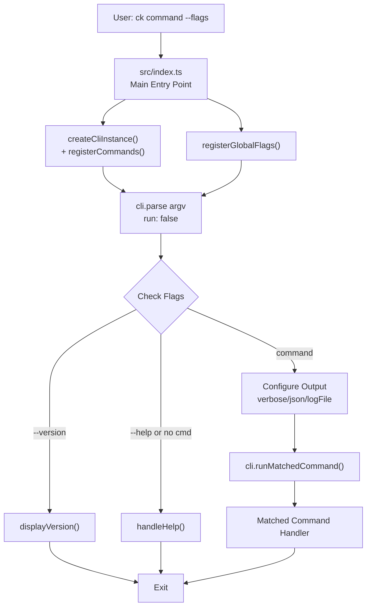

### Entry Point Details

**File**: `src/index.ts`

- Creates CLI instance with `cac('ck')`
- Registers all commands via `command-registry.ts`
- Sets up three-stage initialization:
  1. Command registration and global flags
  2. Parse argv with `run: false` (prevents auto-execution)
  3. Check for version/help/command before execution
- Graceful shutdown handlers for SIGINT/SIGTERM
- JSON buffer flushed on exit to prevent data loss

---

## 2. `ck new` Command Flow

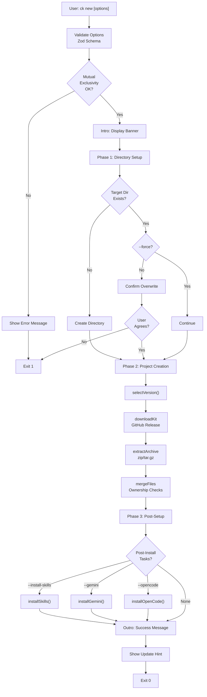

### `ck new` Phases

**Phase 1: Directory Setup** (`handleDirectorySetup`)
- Validate/create target directory
- Check for ownership conflicts
- Confirm overwrite if directory exists

**Phase 2: Project Creation** (`handleProjectCreation`)
- Select version (interactive or `--release`)
- Download kit from GitHub release
- Extract archive (zip or tar.gz)
- Merge files with ownership protection
- Install npm dependencies

**Phase 3: Post-Setup** (`handlePostSetup`)
- Optional: Install skills
- Optional: Install Gemini MCP
- Optional: Open in code editor
- Setup wizard: Prompts for required env keys (e.g., `GEMINI_API_KEY`) if missing

---

## 3. `ck init` Command Flow

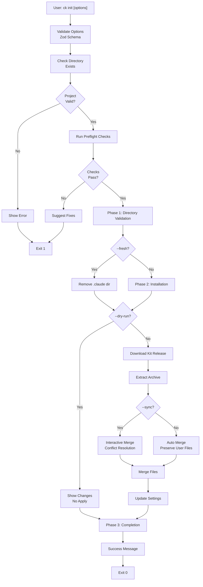

### `ck init` Features

- Handles merge conflicts interactively via `--sync`
- Ownership protection prevents overwriting user files
- Fresh install option (`--fresh`) removes `.claude` dir
- Settings merge preserves customizations
- Dry-run mode shows changes without applying
- Setup wizard: Checks required env keys exist (not just `.env` file), prompts if missing

---

## 4. `ck doctor` Command Flow

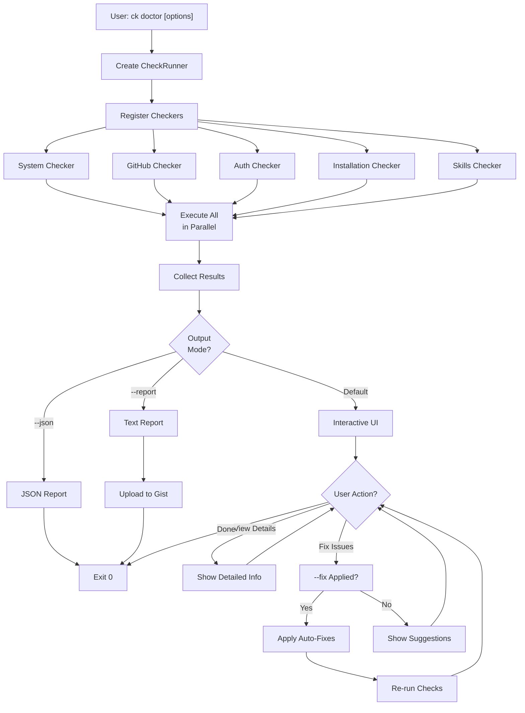

### `ck doctor` Checkers

**Installation Checks**
- Global/project install detection
- CLI installation method (npm, bun, yarn)

**Configuration Checks**
- Settings file validity
- Required fields present
- Path references valid

**System Checks**
- Node.js, npm, Python, git, gh CLI versions
- OS detection (macOS/Windows/Linux)
- Shell detection (Bash, zsh, PowerShell)
- Environment PATH and HOME

**Auth Checks**
- GitHub CLI authentication status
- API connectivity and rate limits

**Project Checks**
- Skill components and dependencies
- Slash command hooks present
- Active CLAUDE.md file
- Required environment keys (e.g., `GEMINI_API_KEY`) in `.env`

---

## 5. Error Handling Flow

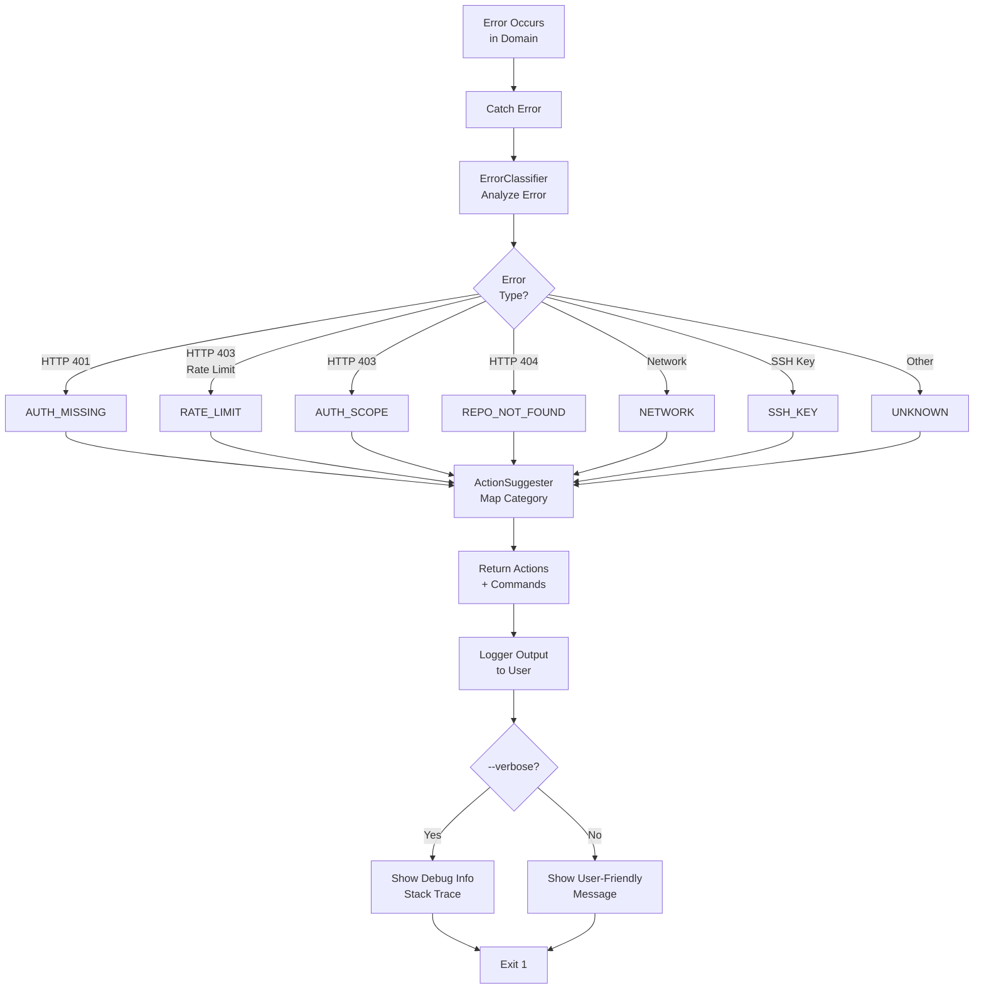

### Error Categories

| Category | Cause | Example | Action |
|----------|-------|---------|--------|
| `RATE_LIMIT` | API rate limit exceeded | 403 with rate-limit header | Wait or re-authenticate |
| `AUTH_MISSING` | GitHub token invalid/expired | 401 Unauthorized | `gh auth login` |
| `AUTH_SCOPE` | Insufficient permissions | 403 without rate-limit | Check scope via `gh auth status` |
| `REPO_NOT_FOUND` | Repository not accessible | 404 Not Found | Check GitHub notifications |
| `NETWORK` | Network connectivity issue | ECONNREFUSED, ETIMEDOUT | `ping github.com` |
| `SSH_KEY` | SSH authentication failed | SSH key errors | Generate key or add to GitHub |
| `UNKNOWN` | Unclassified error | Generic error | Run with `--verbose` |

---

## 6. GitHub Authentication Flow

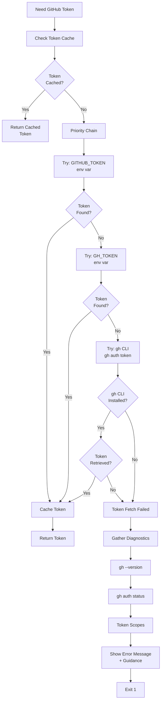

### GitHub Auth Strategy

**Token Priority**:
1. `GITHUB_TOKEN` environment variable (fastest)
2. `GH_TOKEN` environment variable
3. `gh CLI` (with `-h github.com` for multi-host)
4. Detailed error with diagnostics

**Token Caching**:
- Single token per CLI session
- Mutex prevents race conditions
- Cleared after 401 errors

**Fallback Chain**:
- Tries with `-h github.com` flag first
- Falls back to without flag for older `gh` versions
- 5-second timeout per command to prevent hangs

---

## 7. Ownership Tracking System

ClaudeKit uses file ownership tracking to protect user-modified files and prevent unintended overwrites during installations and updates. This system implements the Python packaging standards (pip RECORD pattern) adapted for ClaudeKit's multi-kit environment.

### TrackedFile Interface

Every file in the `.claude` directory is tracked with ownership metadata:

```typescript
interface TrackedFile {
  path: string;                    // Relative path from .claude (e.g., "rules/development-rules.md")
  checksum: string;                // SHA-256 hash of file content (hex format, 64 chars)
  ownership: FileOwnership;        // "ck" | "user" | "ck-modified"
  installedVersion: string;        // ClaudeKit version that installed it
  baseChecksum?: string;           // Original checksum at install (for sync detection)
  sourceTimestamp?: string;        // Git commit timestamp from kit repo (ISO 8601)
  installedAt?: string;            // When file was installed locally (ISO 8601)
}

type FileOwnership = "ck" | "user" | "ck-modified";
```

### metadata.json Structure

The `.claude/metadata.json` file tracks all installed files with multi-kit support:

```json
{
  "kits": {
    "engineer": {
      "version": "0.5.0",
      "installedAt": "2025-01-21T10:30:00.000Z",
      "files": [
        {
          "path": "CLAUDE.md",
          "checksum": "abc123def456...",
          "ownership": "ck",
          "installedVersion": "0.5.0"
        },
        {
          "path": "rules/development-rules.md",
          "checksum": "fed789abc456...",
          "ownership": "ck-modified",
          "installedVersion": "0.5.0",
          "baseChecksum": "fed789abc457..."
        }
      ],
      "installedSettings": {
        "hooks": ["/cook"],
        "mcpServers": ["gemini-mcp"]
      }
    }
  },
  "scope": "local"
}
```

### Ownership Determination

The `OwnershipChecker` class determines file ownership through this logic:

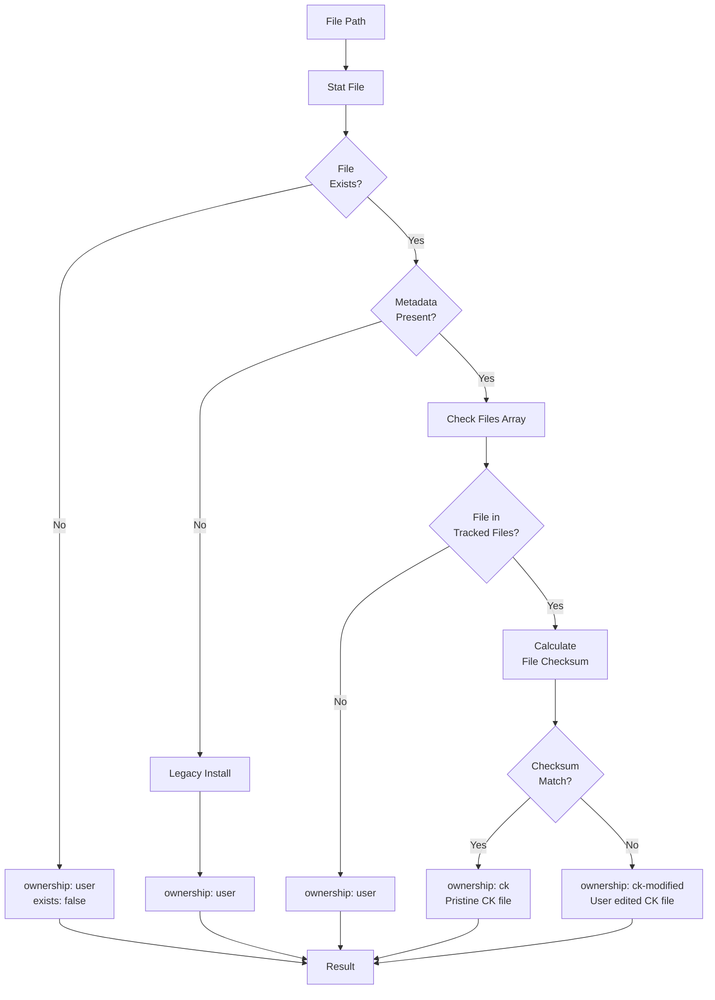

**Ownership Classes:**
- **`"ck"`** - ClaudeKit-owned file, unchanged since install (pristine)
- **`"ck-modified"`** - ClaudeKit-owned file, user has modified
- **`"user"`** - User-created file, not from ClaudeKit

---

## 8. File Merge & Migration Flow

When installing or updating ClaudeKit, the system must merge new files with existing installations while preserving user modifications. This section covers legacy migration and modern merge logic.

### Legacy Installation Detection

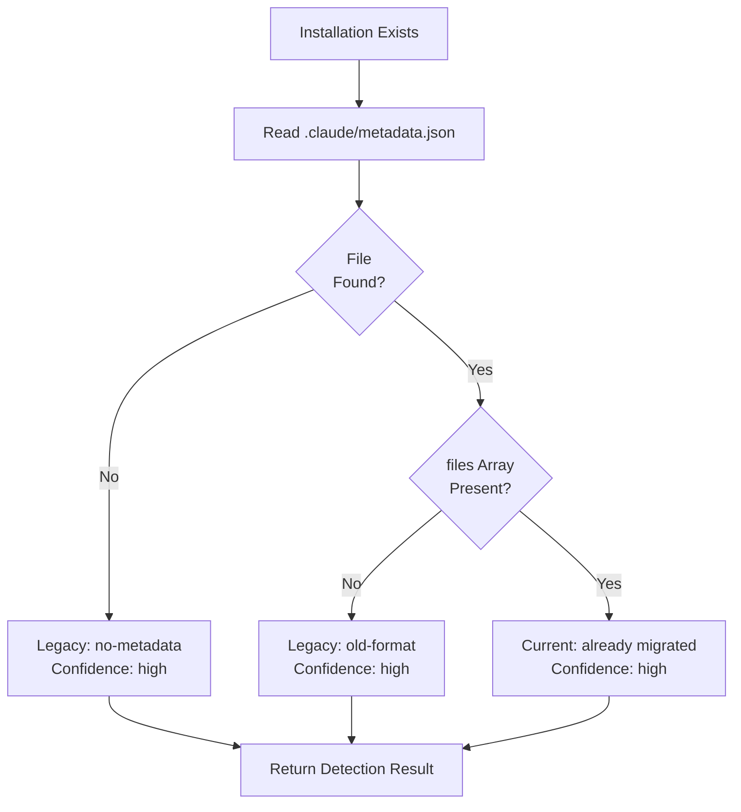

### File Classification During Migration

When migrating a legacy install, files are classified by comparing against the release manifest:

```typescript
interface MigrationPreview {
  ckPristine: string[];     // CK files, unmodified
  ckModified: string[];     // CK files, user edited
  userCreated: string[];    // User's custom files
  totalFiles: number;
}
```

**Classification Steps:**
1. Scan all files in `.claude` directory recursively
2. For each file, compute relative path (normalized to forward slashes)
3. Look up file in release manifest by path
4. If not in manifest → `userCreated` (no checksum calculation)
5. If in manifest → calculate SHA-256 checksum
6. Compare checksum:
   - Match → `ckPristine`
   - Mismatch → `ckModified`

### Checksum Calculation

Checksums use **streaming SHA-256** for memory efficiency:

```typescript
async calculateChecksum(filePath: string): Promise<string> {
  // Returns hex string (64 characters)
  // Example: "abc123def456789..." (lowercase hex digits)
}
```

**Important for Global Installs:** When generating the release manifest (`bun scripts/generate-release-manifest.ts`), checksums are calculated AFTER applying path transformation. This ensures manifest checksums match files after `ck init -g` transforms `.claude/` paths to `$HOME/.claude/`.

### Migration Execution

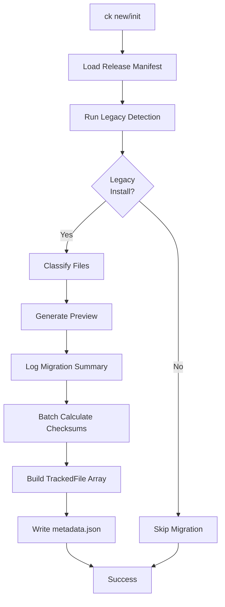

**Concurrency:** File checksums are calculated with concurrency limiting (mapWithLimit) to prevent EMFILE errors on Windows with large file sets.

---

## 9. Release Manifest Generation

The release manifest (`release-manifest.json`) is the source of truth for file ownership verification. It tracks all ClaudeKit-owned files with checksums computed AFTER path transformation.

### Purpose

- **Ownership verification**: Compare installed file checksums against manifest to determine ownership
- **Path transformation compensation**: Manifest includes post-transformation checksums so global installs work correctly
- **File integrity**: Detect user modifications vs pristine CK files
- **Multi-kit support**: Enables reliable file tracking across kit updates

### Generation Process

```bash
# From kit repository root
bun scripts/generate-release-manifest.ts /path/to/.claude
```

**Script Workflow:**

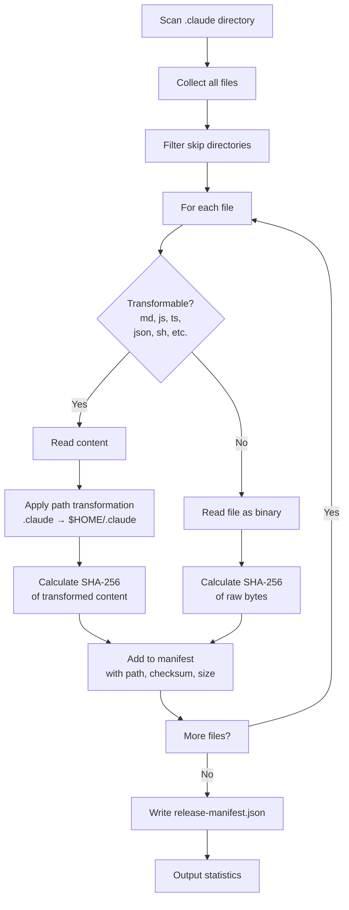

### Manifest Structure

```json
{
  "version": "0.5.0",
  "generatedAt": "2025-01-21T10:30:00.000Z",
  "files": [
    {
      "path": "CLAUDE.md",
      "checksum": "abc123def456789abc123def456789abc123def456789abc123def456789abc1",
      "size": 2048
    },
    {
      "path": "rules/development-rules.md",
      "checksum": "fed789abc456def789abc456def789abc456def789abc456def789abc456def78",
      "size": 5120
    }
  ]
}
```

### File Type Handling

**Transformable Extensions:**
```
.md, .js, .ts, .json, .sh, .ps1, .yaml, .yml, .toml
```

**Always Transformed (regardless of extension):**
```
CLAUDE.md, claude.md
```

**Non-transformable Files:**
- Binary files (.png, .jpg, .pdf, etc.) - checksummed as-is
- Directories with excluded names (node_modules, .git, __pycache__, etc.) - skipped entirely

---

## 10. Global Path Transformation

When installing ClaudeKit globally (with `-g` flag), file paths must be transformed from relative `.claude/` references to platform-appropriate home directory paths. This enables kit files to work correctly regardless of installation scope.

### Transformation Trigger

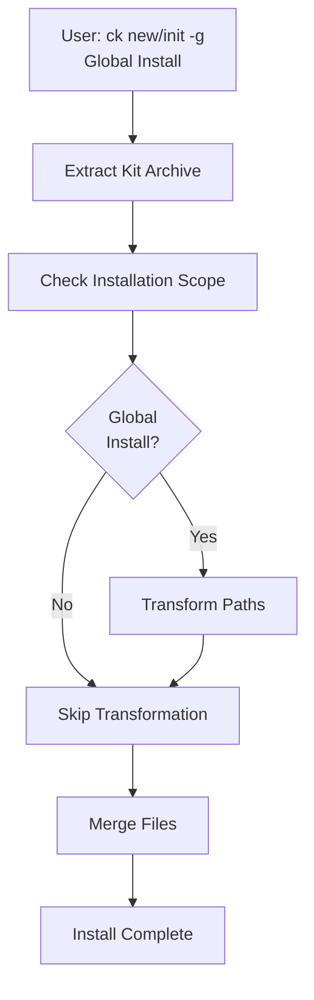

### Platform-Specific Home Directory

| Platform | Env Variable | Transformed To | Example |
|----------|----------------|---|---------|
| Unix/Linux/macOS | `$HOME` | `./.claude/` → `$HOME/.claude/` | `/home/user/.claude/` |
| Windows (PowerShell) | `%USERPROFILE%` | `./.claude/` → `%USERPROFILE%/.claude/` | `C:\Users\User\.claude\` |

**Critical:** Use environment variable syntax, not literal paths:
- ✓ Correct: `$HOME/.claude/` (works everywhere)
- ✗ Wrong: `/home/user/.claude/` (hardcoded path)

### Path Transformation Patterns

The `GlobalPathTransformer` detects and transforms multiple patterns:

```typescript
// Unix-style patterns
./.claude/          → $HOME/.claude/
@.claude/           → @$HOME/.claude/
".claude/           → "$HOME/.claude/
`.claude/           → `$HOME/.claude/

// Windows patterns (when on Windows platform)
$HOME/.claude/      → %USERPROFILE%/.claude/
${HOME}/.claude/    → %USERPROFILE%/.claude/

// Project-relative (during global install)
$CLAUDE_PROJECT_DIR/.claude/     → $HOME/.claude/
${CLAUDE_PROJECT_DIR}/.claude/   → ${HOME}/.claude/
%CLAUDE_PROJECT_DIR%/.claude/    → %USERPROFILE%/.claude/

// Context patterns
: .claude/          → : $HOME/.claude/ (YAML/JSON colons)
(.claude/           → ($HOME/.claude/ (markdown links)
```

### Transformation Examples

**Before (global install):**
```markdown
# Configure Claude
Add your key to `./.claude/settings.json`
```

**After (Unix - $HOME used):**
```markdown
# Configure Claude
Add your key to `$HOME/.claude/settings.json`
```

**After (Windows - %USERPROFILE% used):**
```markdown
# Configure Claude
Add your key to `%USERPROFILE%/.claude/settings.json`
```

### Transformation Flow

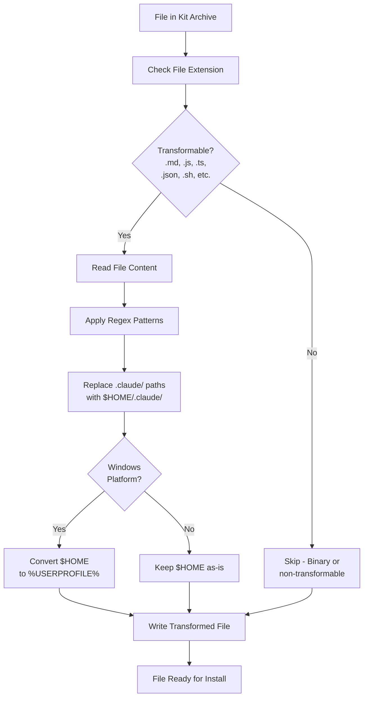

### Directory Skip Rules

During path transformation, these directories are **skipped** to avoid unintended transformations:

- `node_modules/` - Package dependencies
- `.git/` - Version control history
- `__pycache__/` - Python cache
- `.venv/`, `venv/` - Virtual environments
- Hidden directories (except `.claude/` itself) - To skip example projects with nested `.claude/`

**Design Note:** Archive source content should not contain nested `.claude` directories (e.g., example projects). If archives do contain nested `.claude` dirs, they're skipped to avoid unintended path transformations in template/example code.

### Transformation Statistics

After transformation, stats are reported:

```typescript
{
  filesTransformed: number;  // Files that had 1+ path replacements
  totalChanges: number;      // Total number of path patterns replaced
  filesSkipped: number;      // Files that couldn't be read
  skippedFiles: Array<{
    path: string;
    reason: string;         // "Permission denied", encoding error, etc.
  }>;
}
```

---

## Key Components

### Installation Domain (`src/domains/installation/`)

**DownloadManager**
- Fetch releases from GitHub API
- Stream-based downloads with progress tracking
- Automatic retry logic
- Temp directory fallback (OS tmp → `~/.claudekit/tmp`)

**Extractors**
- `TarExtractor` - Handle .tar.gz files
- `ZipExtractor` - Handle .zip files
- Both support exclusion patterns
- Extraction size tracking with warnings

**SelectiveMerger**
- Hybrid file comparison (size → checksum)
- Multi-kit awareness (detect shared files)
- Timestamp-based resolution for conflicts
- Manifest integration for ownership tracking

### GitHub Domain (`src/domains/github/`)

**AuthManager**
- Multi-tier token retrieval with caching
- Environment variable priority
- gh CLI integration
- Detailed error diagnostics

**GitHubClient**
- REST API endpoints (repos, releases)
- Release listing and asset downloads
- Repository metadata and access checks
- Error classification and handling

### Health Checks Domain (`src/domains/health-checks/`)

**CheckRunner**
- Orchestrates parallel checker execution
- Filters by group and priority
- Aggregates results into CheckSummary

**Checkers** (15+ specialized checkers)
- Installation, configuration, system checks
- Authentication and API connectivity
- Project setup and permissions validation

**AutoHealer**
- Automatic remediation for common issues
- Suggests or applies fixes based on check results

### Error Domain (`src/domains/error/`)

**ErrorClassifier**
- Maps HTTP errors to user-friendly categories
- Pattern matching on error messages
- Rate limit countdown calculation

**ActionSuggester**
- Category → actionable fix commands
- Provides clear step-by-step guidance
- Includes diagnostic information

### Migration Domain (`src/domains/migration/`)

**LegacyMigration**
- Detect legacy (pre-metadata) installations
- Scan directory recursively, filtering skip patterns
- Classify files as ckPristine, ckModified, or userCreated
- Batch checksum calculation with concurrency limiting
- Generate and persist migration preview
- Located in: `src/domains/migration/legacy-migration.ts`

**ReleaseManifestLoader**
- Load and validate release manifest from kit archives
- Query file checksums by relative path
- Support multi-kit installations
- Located in: `src/domains/migration/release-manifest.ts`

### File Operations Services (`src/services/file-operations/`)

**OwnershipChecker**
- Calculate SHA-256 checksums via streaming (memory efficient)
- Determine file ownership: ck, ck-modified, or user
- Batch check with concurrency limiting for EMFILE prevention
- Support multi-kit metadata format
- Located in: `src/services/file-operations/ownership-checker.ts`

**ManifestWriter & ManifestReader**
- Read/write metadata.json with schema validation
- Support both legacy single-kit and modern multi-kit formats
- Atomic writes to prevent partial updates
- Located in: `src/services/file-operations/manifest/`

### Path Transformers (`src/services/transformers/`)

**GlobalPathTransformer**
- Transform `.claude/` references to `$HOME/.claude/` (Unix) or `%USERPROFILE%/.claude/` (Windows)
- Apply transformation during global installs (`-g` flag)
- Support 10+ path patterns (relative, quoted, YAML/JSON, etc.)
- Process directories recursively with skip patterns
- Track transformation statistics (files transformed, total changes, skipped)
- Located in: `src/services/transformers/global-path-transformer.ts`

---

## Related Documentation

- **System Architecture**: `./system-architecture.md` - Detailed component design
- **Code Standards**: `./code-standards.md` - Development patterns and conventions
- **Project Overview**: `./project-overview-pdr.md` - Product requirements
- **Codebase Summary**: `./codebase-summary.md` - File organization and dependencies
