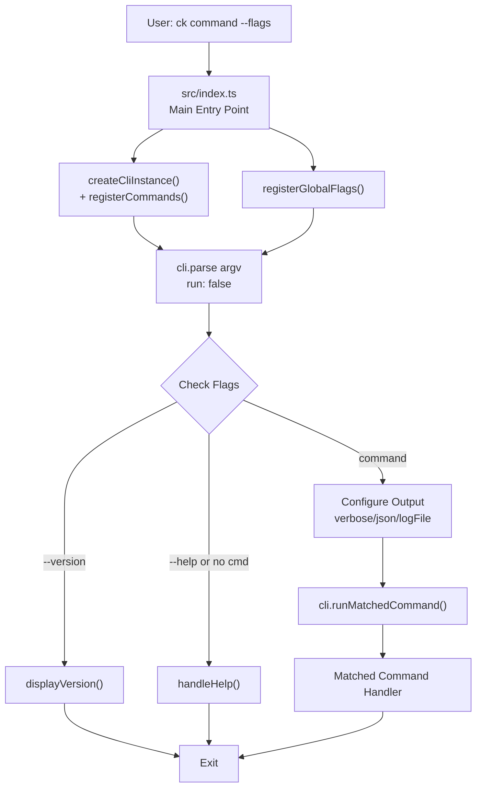
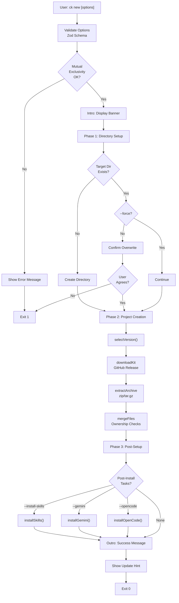
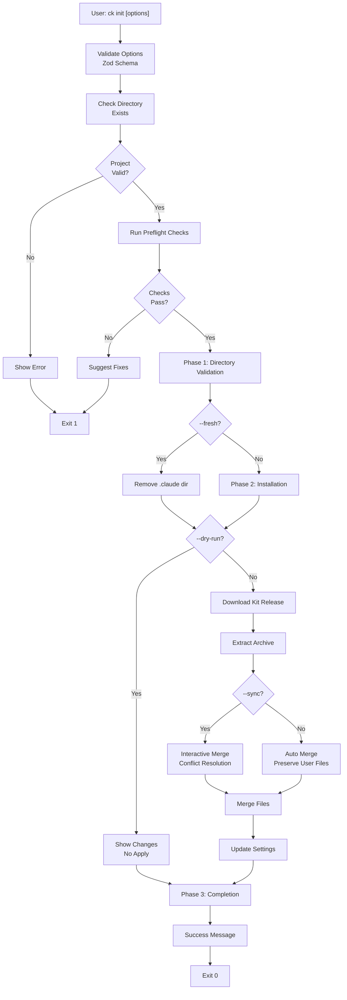
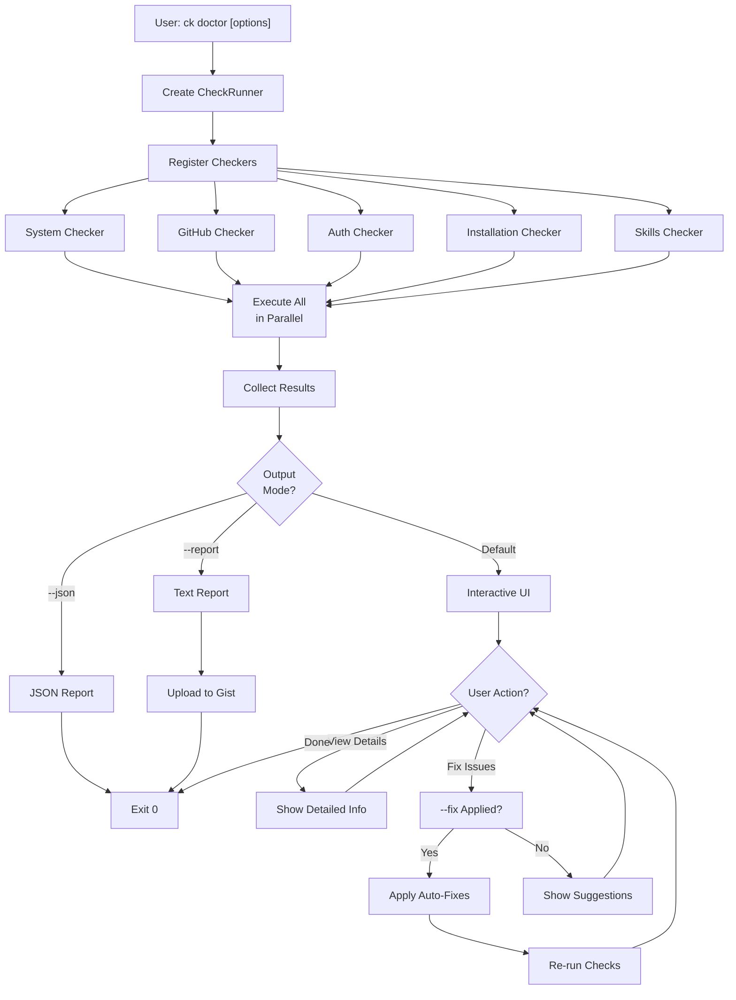
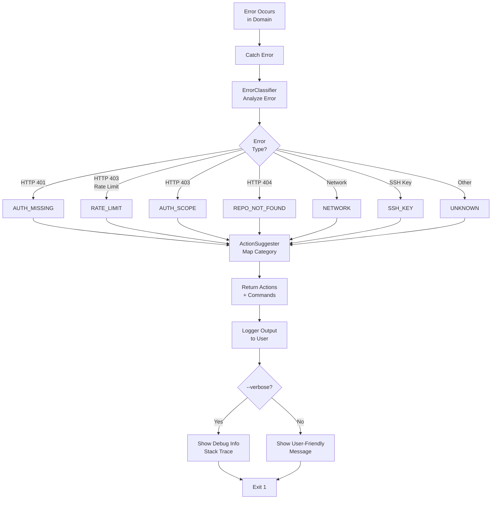
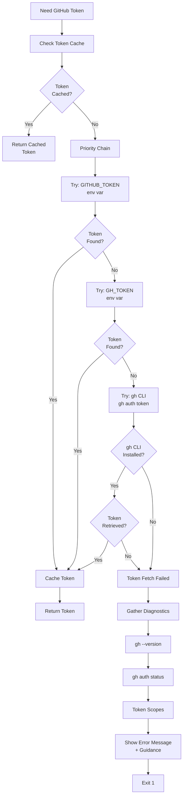

# ClaudeKit CLI (`ck`) Command Flow Guide

## Overview

ClaudeKit CLI (`ck`) is the primary user interface for bootstrapping and managing ClaudeKit projects. It uses the **cac framework** for command parsing and follows a **phase-based execution model** for all major operations.

### Available Commands

| Command | Purpose | Key Flags |
|---------|---------|-----------|
| `new` | Bootstrap new ClaudeKit project | `--kit`, `--release`, `--force`, `--yes` |
| `init` | Initialize/update existing project | `--fresh`, `--sync`, `--dry-run`, `--yes` |
| `doctor` | Health check of ClaudeKit setup | `--fix`, `--json`, `--report`, `--full` |
| `update` | Update CLI to latest version | `--check`, `--yes`, `--beta` |
| `versions` | List available ClaudeKit versions | `--kit`, `--limit`, `--all` |
| `uninstall` | Remove ClaudeKit installations | `--local`, `--global`, `--yes`, `--dry-run` |
| `easter-egg` | Code Hunt 2025 discount generator | None |

### Global Flags

- `--verbose` - Enable debug logging
- `--json` - Machine-readable output
- `--log-file <path>` - Write logs to file
- `-V, --version` - Show version
- `-h, --help` - Show help

---

## 1. CLI Entry Flow

### Entry Point Details

**File**: `src/index.ts`

- Creates CLI instance with `cac('ck')`
- Registers all commands via `command-registry.ts`
- Sets up three-stage initialization:
  1. Command registration and global flags
  2. Parse argv with `run: false` (prevents auto-execution)
  3. Check for version/help/command before execution
- Graceful shutdown handlers for SIGINT/SIGTERM
- JSON buffer flushed on exit to prevent data loss

---

## 2. `ck new` Command Flow

### `ck new` Phases

**Phase 1: Directory Setup** (`handleDirectorySetup`)
- Validate/create target directory
- Check for ownership conflicts
- Confirm overwrite if directory exists

**Phase 2: Project Creation** (`handleProjectCreation`)
- Select version (interactive or `--release`)
- Download kit from GitHub release
- Extract archive (zip or tar.gz)
- Merge files with ownership protection
- Install npm dependencies

**Phase 3: Post-Setup** (`handlePostSetup`)
- Optional: Install skills
- Optional: Install Gemini MCP
- Optional: Open in code editor

---

## 3. `ck init` Command Flow

### `ck init` Features

- Handles merge conflicts interactively via `--sync`
- Ownership protection prevents overwriting user files
- Fresh install option (`--fresh`) removes `.claude` dir
- Settings merge preserves customizations
- Dry-run mode shows changes without applying

---

## 4. `ck doctor` Command Flow

### `ck doctor` Checkers

**Installation Checks**
- Global/project install detection
- CLI installation method (npm, bun, yarn)

**Configuration Checks**
- Settings file validity
- Required fields present
- Path references valid

**System Checks**
- Node.js, npm, Python, git, gh CLI versions
- OS detection (macOS/Windows/Linux)
- Shell detection (Bash, zsh, PowerShell)
- Environment PATH and HOME

**Auth Checks**
- GitHub CLI authentication status
- API connectivity and rate limits

**Project Checks**
- Skill components and dependencies
- Slash command hooks present
- Active CLAUDE.md file

---

## 5. Error Handling Flow

### Error Categories

| Category | Cause | Example | Action |
|----------|-------|---------|--------|
| `RATE_LIMIT` | API rate limit exceeded | 403 with rate-limit header | Wait or re-authenticate |
| `AUTH_MISSING` | GitHub token invalid/expired | 401 Unauthorized | `gh auth login` |
| `AUTH_SCOPE` | Insufficient permissions | 403 without rate-limit | Check scope via `gh auth status` |
| `REPO_NOT_FOUND` | Repository not accessible | 404 Not Found | Check GitHub notifications |
| `NETWORK` | Network connectivity issue | ECONNREFUSED, ETIMEDOUT | `ping github.com` |
| `SSH_KEY` | SSH authentication failed | SSH key errors | Generate key or add to GitHub |
| `UNKNOWN` | Unclassified error | Generic error | Run with `--verbose` |

---

## 6. GitHub Authentication Flow

### GitHub Auth Strategy

**Token Priority**:
1. `GITHUB_TOKEN` environment variable (fastest)
2. `GH_TOKEN` environment variable
3. `gh CLI` (with `-h github.com` for multi-host)
4. Detailed error with diagnostics

**Token Caching**:
- Single token per CLI session
- Mutex prevents race conditions
- Cleared after 401 errors

**Fallback Chain**:
- Tries with `-h github.com` flag first
- Falls back to without flag for older `gh` versions
- 5-second timeout per command to prevent hangs

---

## Key Components

### Installation Domain (`src/domains/installation/`)

**DownloadManager**
- Fetch releases from GitHub API
- Stream-based downloads with progress tracking
- Automatic retry logic
- Temp directory fallback (OS tmp → `~/.claudekit/tmp`)

**Extractors**
- `TarExtractor` - Handle .tar.gz files
- `ZipExtractor` - Handle .zip files
- Both support exclusion patterns
- Extraction size tracking with warnings

**SelectiveMerger**
- Hybrid file comparison (size → checksum)
- Multi-kit awareness (detect shared files)
- Timestamp-based resolution for conflicts
- Manifest integration for ownership tracking

### GitHub Domain (`src/domains/github/`)

**AuthManager**
- Multi-tier token retrieval with caching
- Environment variable priority
- gh CLI integration
- Detailed error diagnostics

**GitHubClient**
- REST API endpoints (repos, releases)
- Release listing and asset downloads
- Repository metadata and access checks
- Error classification and handling

### Health Checks Domain (`src/domains/health-checks/`)

**CheckRunner**
- Orchestrates parallel checker execution
- Filters by group and priority
- Aggregates results into CheckSummary

**Checkers** (15+ specialized checkers)
- Installation, configuration, system checks
- Authentication and API connectivity
- Project setup and permissions validation

**AutoHealer**
- Automatic remediation for common issues
- Suggests or applies fixes based on check results

### Error Domain (`src/domains/error/`)

**ErrorClassifier**
- Maps HTTP errors to user-friendly categories
- Pattern matching on error messages
- Rate limit countdown calculation

**ActionSuggester**
- Category → actionable fix commands
- Provides clear step-by-step guidance
- Includes diagnostic information

---

## Related Documentation

- **System Architecture**: `./system-architecture.md` - Detailed component design
- **Code Standards**: `./code-standards.md` - Development patterns and conventions
- **Project Overview**: `./project-overview-pdr.md` - Product requirements
- **Codebase Summary**: `./codebase-summary.md` - File organization and dependencies
