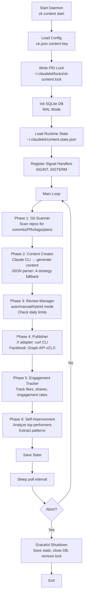

# ClaudeKit Content Command (`ck content`)

## Overview

`ck content` is a multi-channel content automation daemon that monitors your git repositories, automatically generates social media content based on commits, PRs, tags, and plan completions, and publishes to X (Twitter) and Facebook with optional engagement tracking and self-improvement.

**Key Features:**
- Real-time git event monitoring across single or multiple repositories
- AI-powered content generation via Claude CLI
- Multi-platform publishing (X/Twitter, X threads, Facebook)
- Review modes: auto (publish immediately), manual (require approval), hybrid
- Engagement tracking and performance analytics
- Self-improvement through pattern extraction from high-performing posts
- SQLite WAL database for persistence and recovery

---

## Quick Start

```bash
# Interactive onboarding setup
ck content setup

# Start the daemon
ck content start

# Check daemon status
ck content status

# View recent logs
ck content logs --tail

# Approve pending content
ck content approve <id>

# Stop the daemon
ck content stop
```

---

## Available Actions

| Action | Purpose | Options |
|--------|---------|---------|
| `start` | Launch daemon (scan→create→review→publish cycle) | `--force`, `--verbose`, `--dry-run` |
| `stop` | Graceful shutdown via SIGTERM | None |
| `status` | Show running state, config, last scan time | None |
| `logs` | View/follow today's log file | `--tail` |
| `setup` | Interactive onboarding — configure platforms, credentials, schedule | None |
| `queue` | List content items pending review/scheduling | None |
| `approve <id>` | Approve content for publishing | None |
| `reject <id>` | Reject content with optional reason | `--reason <text>` |

---

## Architecture Overview



---

## Configuration

Content is configured via `.ck.json` in your project root:

```json
{
  "content": {
    "enabled": true,
    "pollIntervalMs": 60000,
    "platforms": {
      "x": {
        "enabled": true,
        "maxPostsPerDay": 5,
        "threadMaxParts": 6
      },
      "facebook": {
        "enabled": true,
        "pageId": "YOUR_PAGE_ID",
        "maxPostsPerDay": 3
      }
    },
    "reviewMode": "hybrid",
    "schedule": {
      "timezone": "UTC",
      "quietHoursStart": "23:00",
      "quietHoursEnd": "06:00"
    },
    "selfImprovement": {
      "enabled": true,
      "engagementCheckIntervalHours": 6,
      "topPerformingCount": 10
    },
    "maxContentPerDay": 10,
    "contentDir": "~/.claudekit/content/",
    "dbPath": "~/.claudekit/content.db"
  }
}
```

### Configuration Fields

**Platform Options**
- `x.enabled` - Publish to X/Twitter (requires xurl CLI installed)
- `x.maxPostsPerDay` - Rate limit posts per day
- `x.threadMaxParts` - Max parts in a thread (default: 6)
- `facebook.enabled` - Publish to Facebook (requires Graph API token)
- `facebook.pageId` - Facebook page ID
- `facebook.maxPostsPerDay` - Rate limit posts per day

**Review Modes**
- `auto` - Publish immediately after generation (useful for testing)
- `manual` - Always require explicit approval via `ck content approve <id>`
- `hybrid` - Auto-publish high-confidence, manual for others

**Schedule**
- `timezone` - Schedule timezone (e.g., "America/New_York")
- `quietHoursStart` - Don't publish after this time (24-hour format)
- `quietHoursEnd` - Resume publishing after this time
- Respects daily post limits during quiet hours

**Self-Improvement**
- `enabled` - Track engagement metrics and refine content
- `engagementCheckIntervalHours` - How often to check platform engagement (6 = 4x/day)
- `topPerformingCount` - Analyze top N posts (default: 10)

---

## Database Schema

SQLite database at `~/.claudekit/content.db` (WAL mode) contains 5 tables:

### git_events
Tracks detected git activities that might warrant content.

```sql
CREATE TABLE git_events (
  id INTEGER PRIMARY KEY,
  repo_path TEXT NOT NULL,
  repo_name TEXT NOT NULL,
  event_type TEXT NOT NULL,  -- commit, pr_merged, plan_completed, tag, release
  ref TEXT NOT NULL,          -- commit hash, PR#, tag name, release tag
  title TEXT,
  body TEXT,
  author TEXT,
  created_at TEXT,
  processed BOOLEAN DEFAULT 0,
  content_worthy BOOLEAN DEFAULT 0,
  importance TEXT DEFAULT 'medium'
);
```

### content_items
Generated content awaiting review/scheduling/publishing.

```sql
CREATE TABLE content_items (
  id INTEGER PRIMARY KEY,
  git_event_id INTEGER NOT NULL,
  platform TEXT NOT NULL,     -- x, x_thread, facebook
  text_content TEXT NOT NULL,
  hashtags TEXT,              -- JSON-encoded string array
  hook_line TEXT,             -- What triggered content creation
  call_to_action TEXT,
  media_path TEXT,
  status TEXT DEFAULT 'draft', -- draft, scheduled, reviewing, approved, publishing, published, failed
  scheduled_at TEXT,
  created_at TEXT,
  updated_at TEXT,
  FOREIGN KEY(git_event_id) REFERENCES git_events(id)
);
```

### publications
Successfully published content with platform URLs.

```sql
CREATE TABLE publications (
  id INTEGER PRIMARY KEY,
  content_item_id INTEGER NOT NULL,
  platform TEXT NOT NULL,
  post_id TEXT,               -- X post ID or Facebook post ID
  post_url TEXT,              -- Full URL to published post
  published_at TEXT,
  FOREIGN KEY(content_item_id) REFERENCES content_items(id)
);
```

### engagement_snapshots
Periodic engagement metrics for published content.

```sql
CREATE TABLE engagement_snapshots (
  id INTEGER PRIMARY KEY,
  publication_id INTEGER NOT NULL,
  engagement_type TEXT,       -- likes, retweets, shares, comments, impressions
  count INTEGER,
  snapshot_at TEXT,
  FOREIGN KEY(publication_id) REFERENCES publications(id)
);
```

### task_logs
Internal logs for audit trail and debugging.

```sql
CREATE TABLE task_logs (
  id INTEGER PRIMARY KEY,
  task_type TEXT,             -- scan, create, review, publish, engagement
  status TEXT,
  result_summary TEXT,
  error_message TEXT,
  created_at TEXT
);
```

---

## Git Scanner

Monitors repositories for events that warrant content creation.

### Supported Event Types

| Event Type | Trigger | Detection |
|----------|---------|-----------|
| `commit` | New commits pushed | Scan git log since last scan |
| `pr_merged` | Pull requests merged | GitHub API: merged PRs since last scan |
| `plan_completed` | Plan milestone reached | Detect `.claude/plans/` directory updates |
| `tag` | New git tags | `git tag` listing |
| `release` | GitHub releases published | GitHub API releases endpoint |

### Detection Logic

1. **Repo Discovery**: Scan current directory or subdirectories for `.git` folders
2. **Fetch Events**: Query each repo's git history or GitHub API
3. **Content Worthiness Filter**: Score events by:
   - Keywords in commit message/title (feature, fix, breaking, release)
   - Author reputation
   - Impact scope (files changed, PR size)
4. **Duplicate Prevention**: Track processed event IDs to avoid re-processing

### Configuration in Scanner

```typescript
// From content-command.ts phases
const scanResult = await scanGitRepos(cwd, config, state);
// Returns:
{
  totalRepos: number;
  eventsFound: number;
  contentWorthyEvents: number;
}
```

---

## Content Creator Engine

Generates social media content using Claude CLI via stdin prompts.

### Generation Process

1. **Prompt Construction**: Build multi-part prompt including:
   - Event details (commit message, PR title, release notes)
   - Target platform (X vs Facebook)
   - Company voice/brand guidelines from config
   - Historical top-performing patterns

2. **Claude CLI Invocation**: Spawn `ck` (or configured Claude CLI):
   ```bash
   echo "Prompt text..." | ck --stream | capture JSON
   ```

3. **Response Parsing**: Apply 4-strategy fallback parser:
   - **Strategy 1**: Extract JSON code block (most reliable)
   - **Strategy 2**: Parse raw JSON if no code blocks
   - **Strategy 3**: Regex search for JSON object
   - **Strategy 4**: Prompt Claude to format response as JSON

4. **Validation**: Verify generated content:
   - Non-empty text (min 10 chars)
   - Valid hashtags (JSON array)
   - Platform compliance (X: 280 char limit, threads: 6 parts max)

### Content Structure

Generated content includes:

```typescript
interface GeneratedContent {
  textContent: string;           // Main post text
  hashtags: string[];            // Relevant hashtags
  hookLine: string;              // "Inspired by: [commit hash]"
  callToAction: string;          // Optional CTA
  mediaPath?: string;            // Path to image/video (if applicable)
}
```

### Error Handling

- Claude CLI timeout: fallback to template-based generation
- JSON parse failure: try all 4 strategies before giving up
- Content validation failure: mark as `failed` and log issue

---

## Review Modes

### Auto Mode
Publishes content immediately after generation. Useful for testing:

```bash
ck content setup  # Set reviewMode: auto
ck content start  # Content publishes automatically
```

### Manual Mode
Requires explicit approval:

```bash
ck content start    # Daemon generates content, holds in "draft"
ck content queue    # List pending content
ck content approve 42  # Approve item ID 42
ck content reject 42 --reason "Too promotional"
```

### Hybrid Mode
Auto-publishes high-confidence content (>85% score), holds uncertain items:

```bash
# Content scoring: keyword relevance, length, grammar
# High score → auto-publish
# Low score → manual review via ck content queue
```

---

## Publishing Adapters

### X/Twitter Adapter

**Requirements:**
- `xurl` CLI installed and authenticated
- X API credentials configured via `xurl`

**Publishing Process:**
1. Check daily post limits (default: 5/day)
2. Check quiet hours schedule
3. Invoke `xurl` CLI:
   ```bash
   xurl post "Tweet text" --replyTo <id>  # for threads
   ```
4. Capture returned post ID and URL
5. Store in `publications` table

**Thread Support:**
- Split long content into max 6 parts (configurable)
- Each part replies to previous (threaded conversation)
- Media attached to first tweet

### Facebook Adapter

**Requirements:**
- Facebook Page Access Token (not User token)
- Page ID configured in `.ck.json`

**Publishing Process:**
1. Expand shortened URLs to full forms
2. Call Graph API v21.0:
   ```
   POST /me/feed
   message=<text>
   picture=<url>
   link=<url>
   ```
3. Capture returned post ID
4. Construct post URL: `https://facebook.com/{page_id}/posts/{post_id}`
5. Store in `publications` table

**Rate Limiter:**
- Respect platform API rate limits
- Default: 3 posts/day (configurable)
- Implement exponential backoff on 429 responses

---

## State Management

Runtime state persisted at `~/.claudekit/content.state.json`:

```typescript
interface ContentState {
  lastScanAt: string | null;              // ISO 8601 timestamp
  lastEngagementCheckAt: string | null;   // ISO 8601 timestamp
  processedEvents: string[];              // Event IDs already processed
  contentQueue: number[];                 // Content item IDs pending action
  currentlyCreating: number | null;       // ID being created right now
  dailyPostCounts: Record<string, number>; // "2025-03-05": 3 (posts today)
}
```

**State Saving:**
- After each major phase (scan, create, review, publish)
- On graceful shutdown (SIGINT/SIGTERM)
- Atomic writes to prevent corruption

---

## Engagement Tracking

Self-improvement phase periodically checks published content performance:

### Engagement Metrics

- **Likes** - X: favorites, Facebook: reactions
- **Retweets** - X only
- **Shares** - Facebook only
- **Comments** - Both platforms
- **Impressions** - Estimated reach

### Performance Analysis

1. **Fetch Snapshots**: Pull engagement data for top 10 recent posts (configurable)
2. **Score Posts**: Calculate engagement rate:
   ```
   score = (likes + retweets*2 + comments*3) / impressions
   ```
3. **Extract Patterns**: Analyze top performers for:
   - Common themes (keywords, topics)
   - Optimal post length
   - Best hashtag combinations
   - Timing patterns (when published)
4. **Update Guidelines**: Feed patterns back to content generator

### Configuration

```json
"selfImprovement": {
  "enabled": true,
  "engagementCheckIntervalHours": 6,   // Check every 6 hours = 4x/day
  "topPerformingCount": 10              // Analyze top 10 posts
}
```

---

## Onboarding Wizard

Interactive setup via `ck content setup` walks through:

### Step 1: Enable Content Engine
```
Enable content automation? (y/n)
```

### Step 2: Configure X/Twitter
```
Enable X/Twitter? (y/n)
- Install xurl CLI? (link to instructions)
- Max posts per day? (default: 5)
- Thread max parts? (default: 6)
```

### Step 3: Configure Facebook
```
Enable Facebook? (y/n)
- Page ID? (find at facebook.com/your-page/settings)
- Access Token? (Graph API token)
- Max posts per day? (default: 3)
```

### Step 4: Review Mode
```
Review mode?
- auto (publish immediately)
- manual (require approval)
- hybrid (auto if confident, manual if uncertain)
```

### Step 5: Schedule & Limits
```
Timezone? (default: UTC)
Quiet hours start? (default: 23:00)
Quiet hours end? (default: 06:00)
Max content per day? (default: 10)
```

### Step 6: Self-Improvement
```
Enable engagement tracking & self-improvement? (y/n)
Check engagement every X hours? (default: 6)
Analyze top N posts? (default: 10)
```

---

## Security Considerations

### Credential Handling
- **No token logging**: Platform tokens never written to logs or console
- **Stdin prompts**: Credentials entered via secure prompts, not CLI args
- **Environment variables**: Optional (not required if using .ck.json)
- **File permissions**: .ck.json should be `0600` (user-readable only)

### PID Lock File
- Location: `~/.claudekit/locks/ck-content.lock`
- Prevents multiple daemons running simultaneously
- Removed on graceful shutdown
- Stale lock detection on startup (process ID validation)

### Database Security
- **WAL mode**: Write-ahead logging prevents corruption on hard crashes
- **Atomic writes**: State persisted atomically to prevent partial updates
- **User-readable only**: Database file permissions `0600`

---

## Logging

Content daemon logs to `~/.claudekit/logs/content-YYYYMMDD.log`:

### Log Levels

- **INFO**: Major phase completions (scan, create, publish)
- **WARN**: Rate limits approaching, quiet hours, config issues
- **ERROR**: Failed generations, publishing errors, API failures

### Log Rotation

- Daily files by date (content-20250305.log)
- Old logs kept for 30 days
- Manual cleanup via: `rm ~/.claudekit/logs/content-*.log`

### Verbose Mode

```bash
ck content start --verbose
```

Includes:
- Per-event details during scanning
- Full Claude CLI prompts and responses
- Platform API request/response bodies
- Detailed timing information

---

## Troubleshooting

### Daemon Won't Start
```bash
# Check for stale lock file
ls ~/.claudekit/locks/ck-content.lock

# Validate config
ck content status

# Check logs
ck content logs

# Force restart if needed
ck content stop  # No-op if not running
ck content start --force
```

### Content Not Generating
- Verify `enabled: true` in config
- Check Claude CLI is installed: `which ck`
- Review error logs: `ck content logs --tail`
- Test Claude CLI: `echo "Hello" | ck --stream`

### Publishing Failures
- **X**: Verify `xurl` installed: `which xurl`
- **X**: Check auth: `xurl status`
- **Facebook**: Verify Page Access Token has `pages_manage_metadata` scope
- **Facebook**: Check Page ID is correct (not User ID)

### Rate Limit Issues
- Reduce `maxPostsPerDay` for platform
- Increase `pollIntervalMs` to give more time between cycles
- Check platform API rate limit headers in logs

---

## Command Examples

```bash
# Setup with prompts
ck content setup

# Start daemon in background
ck content start &

# View status
ck content status

# Generate content but don't publish
ck content start --dry-run

# Follow logs in real-time
ck content logs --tail

# Queue of pending items
ck content queue

# Approve content
ck content approve 42

# Reject with reason
ck content reject 42 --reason "Off-brand tone"

# Stop daemon
ck content stop

# Restart with force
ck content start --force

# Verbose logging
ck content start --verbose
```

---

## Related Documentation

- **Main Command Guide**: `./ck-command-flow-guide.md` - CLI overview
- **Watch Command**: `./ck-watch.md` - GitHub issue auto-responder
- **System Architecture**: `./system-architecture.md` - Technical design
