# ClaudeKit Content Command (`ck content`)

## Overview

`ck content` is a multi-channel content automation daemon that monitors git repositories, generates social media content based on commits, PRs, tags, and plan completions, and publishes to X (Twitter) and Facebook with optional engagement tracking and self-improvement.

**Key Features:**
- Real-time git event monitoring across single or multiple repositories
- Multi-phase content pipeline: scan → filter → classify → build context → generate → validate → review → publish → track
- AI-powered content generation via Claude CLI
- Multi-platform publishing (X/Twitter, X threads, Facebook)
- Review modes: auto (publish immediately), manual (require approval), hybrid
- Engagement tracking and performance analytics
- SQLite WAL database for persistence and recovery

---

## Quick Start

```bash
# Interactive onboarding setup
ck content setup

# Start the daemon
ck content start

# Check daemon status
ck content status

# View recent logs
ck content logs --tail

# Approve pending content (manual review mode)
ck content approve <id>

# Stop the daemon
ck content stop
```

---

## Available Actions

| Action | Purpose | Options |
|--------|---------|---------|
| `start` | Launch daemon (scan→create→review→publish cycle) | `--force`, `--verbose`, `--dry-run` |
| `stop` | Graceful shutdown via SIGTERM | None |
| `status` | Show running state, config, last scan time | None |
| `logs` | View/follow today's log file | `--tail` |
| `setup` | Interactive onboarding — configure platforms, credentials, schedule | None |
| `queue` | List content items pending review/scheduling | None |
| `approve <id>` | Approve content for publishing | None |
| `reject <id>` | Reject content with optional reason | `--reason <text>` |

---

## Architecture Overview

```mermaid
flowchart TD
    A["Start Daemon<br/>ck content start"] --> B["Load Config<br/>.ck.json content key"]
    B --> C["Write PID Lock<br/>~/.claudekit/locks/ck-content.lock"]
    C --> D["Init SQLite DB<br/>WAL Mode"]
    D --> E["Load Runtime State<br/>~/.claudekit/content.state.json"]
    E --> F["Register Signal Handlers<br/>SIGINT, SIGTERM"]
    F --> G["Main Loop"]

    G --> H["Phase 1: Git Scanner<br/>Discover repos, detect events"]
    H --> I["Phase 2: Noise Filter<br/>Remove commits from Dependabot, chores"]
    I --> J["Phase 3: Event Classifier<br/>Score importance, determine formats"]
    J --> K["Phase 4: Context Builder<br/>Assemble docs, brand, examples<br/>24h cache"]
    K --> L["Phase 5: Content Creator<br/>Claude CLI → JSON → parse<br/>4-strategy fallback"]
    L --> M["Phase 6: Content Validator<br/>Check length, hashtags, compliance"]
    M --> N["Phase 7: Review Manager<br/>auto/manual/hybrid mode<br/>Check daily limits"]
    N --> O["Phase 8: Photo Generator<br/>Claude → images<br/>Platform-specific dimensions"]
    O --> P["Phase 9: Publisher<br/>X adapter: xurl CLI<br/>Facebook: Graph API"]
    P --> Q["Phase 10: Engagement Tracker<br/>Track likes, shares, reach"]
    Q --> R["Phase 11: Performance Analyzer<br/>Extract patterns from top posts"]
    R --> S["Save State"]
    S --> T["Sleep poll interval"]
    T --> U{"Abort?"}
    U -->|No| G
    U -->|Yes| V["Graceful Shutdown<br/>Save state, close DB, remove lock"]
    V --> W["Exit"]
```



---

## Configuration

Content is configured via `.ck.json` in your project root:

```json
{
  "content": {
    "enabled": true,
    "pollIntervalMs": 60000,
    "platforms": {
      "x": {
        "enabled": true,
        "maxPostsPerDay": 5,
        "threadMaxParts": 6
      },
      "facebook": {
        "enabled": true,
        "maxPostsPerDay": 3
      }
    },
    "reviewMode": "hybrid",
    "schedule": {
      "timezone": "UTC",
      "quietHoursStart": "23:00",
      "quietHoursEnd": "06:00"
    },
    "selfImprovement": {
      "enabled": true,
      "engagementCheckIntervalHours": 6,
      "topPerformingCount": 10
    },
    "firstScanLookbackDays": 30,
    "maxContentPerDay": 10,
    "contentDir": "~/.claudekit/content/",
    "dbPath": "~/.claudekit/content.db"
  }
}
```

### Configuration Fields

| Field | Type | Default | Purpose |
|-------|------|---------|---------|
| `enabled` | boolean | `false` | Enable/disable entire content engine |
| `pollIntervalMs` | number | `60000` | Milliseconds between scan cycles (60s) |
| `platforms.x.enabled` | boolean | `false` | Publish to X/Twitter |
| `platforms.x.maxPostsPerDay` | number | `5` | Rate limit for X posts |
| `platforms.x.threadMaxParts` | number | `6` | Max parts in X thread |
| `platforms.facebook.enabled` | boolean | `false` | Publish to Facebook |
| `platforms.facebook.maxPostsPerDay` | number | `3` | Rate limit for Facebook posts |
| `reviewMode` | string | `"auto"` | `auto`, `manual`, or `hybrid` |
| `schedule.timezone` | string | `"UTC"` | Timezone (e.g., `"America/New_York"`) |
| `schedule.quietHoursStart` | string | `"23:00"` | No publishing after this time (HH:MM) |
| `schedule.quietHoursEnd` | string | `"06:00"` | Resume publishing after this time (HH:MM) |
| `selfImprovement.enabled` | boolean | `true` | Track engagement and refine patterns |
| `selfImprovement.engagementCheckIntervalHours` | number | `6` | How often to check engagement (hours) |
| `selfImprovement.topPerformingCount` | number | `10` | Number of top posts to analyze |
| `firstScanLookbackDays` | number | `30` | Days to look back on first scan (1-365) |
| `maxContentPerDay` | number | `10` | Absolute cap on content items per day |
| `contentDir` | string | `"~/.claudekit/content/"` | Storage directory for media files |
| `dbPath` | string | `"~/.claudekit/content.db"` | SQLite database location |

---

## Git Scanner Pipeline

### Phase 1: Repository Discovery

Recursively finds all git repositories under the current working directory.

```typescript
// Looks for .git directories
const repos = discoverRepos(cwd);
```

### Phase 2: Change Detection

Detects four types of events since last scan:

| Event Type | Detection Method | Content Worthy Indicator |
|---|---|---|
| `commit` | `git log --since` | Keywords: feat, fix, breaking, release |
| `pr_merged` | GitHub API or local git branch tracking | Merged PR with "feat" in title |
| `tag` | `git tag` listing | Any new tag (high importance) |
| `release` | GitHub API releases endpoint | GitHub release created (high importance) |
| `plan_completed` | Scan `.claude/plans/` directory | Changes to completed plans |

On first scan, looks back `firstScanLookbackDays` (default: 30 days). Subsequent scans use `lastScanAt` timestamp.

### Phase 3: Noise Filtering

Filters out commits unlikely to generate engaging content:

- Commits by `dependabot` (dependency updates)
- Commits starting with `merge ` (merge commits)
- Commits with `chore:`, `docs:`, or `style:` prefixes
- Commits containing "readme" + "typo"

### Phase 4: Event Classification

Scores each event for content-worthiness and importance:

| Event Type | Content Worthy | Importance | Suggested Formats |
|---|---|---|---|
| Feature PR | Yes | High | text, photo |
| Bug fix PR | Yes | Medium | text |
| Tag/Release | Yes | High | text, photo |
| Plan completed | Yes | High | text, photo, thread |
| Feat commit | Yes | Medium | text |
| Other commit | Maybe | Low | text |

Returns a classification object:
```typescript
interface EventClassification {
  contentWorthy: boolean;
  importance: "high" | "medium" | "low";
  suggestedFormats: string[];
}
```

---

## Content Generation Pipeline

### Phase 5: Context Builder

Assembles rich context for content generation from multiple sources:

```typescript
interface ContentContext {
  brandGuidelines: string;        // Project voice/guidelines
  writingStyles: string;          // Tone, style examples
  gitEventDetails: string;        // Commit message, PR title
  recentContent: string;          // Last 5 generated posts
  topPerformingContent: string;   // Best-performing posts (engagement-based)
  platformRules: string;          // X character limit, Facebook best practices
  projectReadme: string;          // README.md content
  projectDocsSummary: string;     // Summarized docs (from docs/ folder)
  currentDateTime: string;        // For scheduling awareness
}
```

**Cache Strategy:** Context is cached at `~/.claudekit/cache/` with 24-hour TTL, invalidated when source docs change (mtime-based hash).

### Phase 6: Content Creator

Orchestrates multi-platform content generation:

1. **Prompt Construction**: Build platform-specific prompt using ContentContext
2. **Claude CLI Invocation**: Spawn Claude via stdin:
   ```bash
   echo "Prompt..." | ck --stream --output-format text --max-turns 40
   ```
3. **Response Parsing**: Apply 4-strategy fallback:
   - Strategy 1: Extract JSON from code block (```json ... ```)
   - Strategy 2: Parse raw JSON if no code blocks
   - Strategy 3: Regex search for JSON object
   - Strategy 4: Ask Claude to re-format as JSON
4. **Return**: GeneratedContent with text, hashtags, hook line, CTA

### Phase 7: Content Validator

Validates generated content against platform rules:

- Text non-empty (min 10 characters)
- Valid JSON hashtag array
- X: 280 character limit per post
- X threads: max 6 parts (configurable)
- Facebook: required fields present

### Phase 8: Photo Generator

Generates images via Claude for visual social media posts:

1. **Prompt**: Build photo-specific prompt from ContentContext
2. **Invoke Claude**: `claude -p --output-format text --max-turns 40` in media directory
3. **Dimensions**: Platform-specific (X: 1200×675, Facebook: 1200×630)
4. **Store**: Save at `~/.claudekit/content/media/{contentId}/`
5. **Link**: Attach `mediaPath` to content item

---

## Review Modes

### Auto Mode
Publishes immediately after generation. Skips approval step.

```bash
# In config
"reviewMode": "auto"
```

### Manual Mode
All content held in `draft` status. Requires explicit approval:

```bash
ck content queue          # List pending
ck content approve 42     # Approve item
ck content reject 42 --reason "Off-brand"
```

### Hybrid Mode
Auto-publishes high-confidence content (>85% validation score). Low-confidence items require manual approval.

---

## Publishing Pipeline

### Phase 9: Publisher

Coordinates publishing across platforms:

1. **Quiet Hours Check**: If in quiet hours window, defer to next cycle
2. **Rate Limit Check**: Verify daily post count not exceeded
3. **Adapter Dispatch**: Route to X or Facebook adapter
4. **Record Publication**: Store in `publications` table with URL
5. **Update Status**: Mark content as `publishing` → `published`

#### X/Twitter Adapter

**Requirements:**
- `xurl` CLI installed and authenticated
- X API v2 credentials configured in `xurl`

**Publishing Process:**
1. Check daily post limit (default: 5)
2. Split long content into thread parts (max 6)
3. Invoke `xurl` CLI:
   ```bash
   xurl post "Tweet text" [--replyTo <id>] [--media <path>]
   ```
4. Capture returned post ID and URL
5. For threads: each part replies to previous

#### Facebook Adapter

**Requirements:**
- Facebook Page Access Token (with `pages_manage_metadata` scope)
- Page ID configured in `.ck.json`

**Publishing Process:**
1. Expand shortened URLs to full forms
2. Call Graph API v21.0:
   ```
   POST /me/feed
   message=<text>
   picture=<url>
   link=<url>
   ```
3. Capture returned post ID
4. Construct post URL: `https://facebook.com/{pageId}/posts/{postId}`
5. Store in `publications` table

#### Rate Limiting

Enforces per-platform limits via RateLimiter class:
- Tracks daily post counts in `state.dailyPostCounts`
- Respects quiet hours window (no posts outside)
- Exponential backoff on API 429 responses
- Counts reset at midnight (timezone-aware)

---

## Database Schema

SQLite at `~/.claudekit/content.db` (WAL mode) contains 5 tables:

### git_events
Detected git activities that might warrant content.

```sql
CREATE TABLE git_events (
  id INTEGER PRIMARY KEY,
  repo_path TEXT NOT NULL,
  repo_name TEXT NOT NULL,
  event_type TEXT NOT NULL,    -- commit, pr_merged, plan_completed, tag, release
  ref TEXT NOT NULL,           -- commit hash, PR#, tag name, release tag
  title TEXT,
  body TEXT,
  author TEXT,
  created_at TEXT,
  processed BOOLEAN DEFAULT 0,
  content_worthy BOOLEAN DEFAULT 0,
  importance TEXT DEFAULT 'medium',
  retry_count INTEGER DEFAULT 0
);
```

### content_items
Generated content awaiting review/scheduling/publishing.

```sql
CREATE TABLE content_items (
  id INTEGER PRIMARY KEY,
  git_event_id INTEGER NOT NULL,
  platform TEXT NOT NULL,       -- x, x_thread, facebook
  text_content TEXT NOT NULL,
  hashtags TEXT,                -- JSON-encoded string array
  hook_line TEXT,               -- "Inspired by: [commit hash]"
  call_to_action TEXT,
  media_path TEXT,              -- Path to generated image
  status TEXT DEFAULT 'draft',  -- draft, scheduled, reviewing, approved, publishing, published, failed
  scheduled_at TEXT,
  created_at TEXT,
  updated_at TEXT,
  FOREIGN KEY(git_event_id) REFERENCES git_events(id)
);
```

### publications
Successfully published content with platform URLs.

```sql
CREATE TABLE publications (
  id INTEGER PRIMARY KEY,
  content_item_id INTEGER NOT NULL,
  platform TEXT NOT NULL,
  post_id TEXT,                 -- X post ID or Facebook post ID
  post_url TEXT,                -- Full URL to published post
  published_at TEXT,
  FOREIGN KEY(content_item_id) REFERENCES content_items(id)
);
```

### engagement_snapshots
Periodic engagement metrics for published content.

```sql
CREATE TABLE engagement_snapshots (
  id INTEGER PRIMARY KEY,
  publication_id INTEGER NOT NULL,
  engagement_type TEXT,         -- likes, retweets, shares, comments, impressions
  count INTEGER,
  snapshot_at TEXT,
  FOREIGN KEY(publication_id) REFERENCES publications(id)
);
```

### task_logs
Internal logs for audit trail and debugging.

```sql
CREATE TABLE task_logs (
  id INTEGER PRIMARY KEY,
  task_type TEXT,               -- scan, create, review, publish, engagement
  status TEXT,
  details TEXT,
  error_message TEXT,
  duration_ms INTEGER,
  created_at TEXT
);
```

---

## Phase 10: Engagement Tracking

Self-improvement module periodically checks published content performance:

1. **Fetch Snapshots**: Retrieve engagement metrics from platforms for recent posts
2. **Score Posts**: Calculate engagement rate (weighted by likes, retweets, comments)
3. **Extract Patterns**: Analyze top N performers for:
   - Common themes and keywords
   - Optimal post length
   - Best hashtag combinations
   - Timing patterns (when published)
4. **Update Guidelines**: Feed patterns back to content generator prompts

**Configuration:**
```json
"selfImprovement": {
  "enabled": true,
  "engagementCheckIntervalHours": 6,  // Check 4x per day
  "topPerformingCount": 10             // Analyze top 10 posts
}
```

---

## Phase 11: Performance Analyzer

Extracts actionable patterns from high-performing posts to refine future content generation:

- Identifies theme clusters in top posts
- Detects optimal post length for platform
- Analyzes hashtag co-occurrence
- Notes timing patterns
- Injects patterns into context builder for next generation cycle

---

## Setup Wizard

Interactive setup via `ck content setup` walks through configuration:

### Step 1: Enable Engine
```
Enable content automation? (y/n)
```

### Step 2: Configure X/Twitter
```
Enable X/Twitter? (y/n)
Max posts per day? (default: 5)
Max thread parts? (default: 6)
```

### Step 3: Configure Facebook
```
Enable Facebook? (y/n)
Max posts per day? (default: 3)
```

### Step 4: Review Mode
```
Review mode? (auto/manual/hybrid, default: auto)
```

### Step 5: Schedule & Limits
```
Timezone? (default: UTC)
Quiet hours start? (HH:MM, default: 23:00)
Quiet hours end? (HH:MM, default: 06:00)
Max content per day? (default: 10)
First scan lookback days? (1-365, default: 30)
```

### Step 6: Self-Improvement
```
Enable engagement tracking? (y/n)
Check engagement every X hours? (default: 6)
Analyze top N posts? (default: 10)
```

---

## State Management

Runtime state persisted at `~/.claudekit/content.state.json`:

```typescript
interface ContentState {
  lastScanAt: string | null;            // ISO 8601 timestamp
  lastEngagementCheckAt: string | null; // ISO 8601 timestamp
  lastCleanupAt: string | null;         // Retention cleanup timestamp
  dailyPostCounts: Record<string, number>; // "2025-03-05": 3 (posts today)
}
```

State is saved atomically after each major phase to enable recovery on restart.

---

## Logging

Daemon logs to `~/.claudekit/logs/content-YYYYMMDD.log`:

**Log Levels:**
- **INFO**: Major phase completions (scan found N events, created M items, published K)
- **WARN**: Rate limits approaching, quiet hours defer, config issues
- **ERROR**: Failed generations, API errors, validation failures

**Rotation:** Daily files by date. Old logs kept per retention policy.

**Verbose Mode:**
```bash
ck content start --verbose
```
Includes per-event details, full prompts/responses, API bodies, timing info.

---

## Troubleshooting

### Daemon Won't Start

```bash
# Check for stale lock
ls ~/.claudekit/locks/ck-content.lock

# Validate config
ck content status

# Review error logs
ck content logs

# Force restart
ck content stop
ck content start --force
```

### Content Not Generating

- Verify `enabled: true` in config
- Check Claude CLI: `which ck`
- Test prompt: `echo "test" | ck --stream`
- Review logs: `ck content logs --tail`

### Publishing Failures

**X:**
- Verify `xurl` installed: `which xurl`
- Check auth: `xurl status`

**Facebook:**
- Verify token scope: `pages_manage_metadata`
- Confirm page ID is not user ID
- Test Graph API: `curl -X GET "https://graph.facebook.com/me/accounts?access_token=..."`

### Rate Limit Issues

- Reduce `maxPostsPerDay` in config
- Increase `pollIntervalMs` between cycles
- Check platform API rate limit headers in logs

---

## Command Examples

```bash
# Setup
ck content setup

# Daemon lifecycle
ck content start &
ck content status
ck content logs --tail
ck content stop

# Content approval (manual/hybrid mode)
ck content queue
ck content approve 42
ck content reject 42 --reason "Off-brand"

# Testing
ck content start --dry-run
ck content start --verbose

# Force restart
ck content start --force
```

---

## Related Documentation

- **Main Command Guide**: `./ck-command-flow-guide.md`
- **Watch Command**: `./ck-watch.md` — GitHub issue auto-responder
- **System Architecture**: `./system-architecture.md` — Technical design
