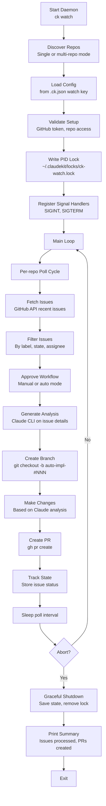

# ClaudeKit Watch Command (`ck watch`)

## Overview

`ck watch` is a long-running GitHub issue daemon that polls for new issues and manages a multi-phase lifecycle: brainstorming clarification → planning → implementation. Designed for 6-8+ hour unattended overnight operation.

**Key Features:**
- Real-time GitHub issue polling (configurable intervals)
- Multi-repo support (single-repo or auto-discovery)
- AI-powered analysis, planning, and implementation via Claude
- Approval-based workflow (awaiting user feedback per issue)
- Rate limiting (per-hour and GitHub API-aware)
- Graceful shutdown with state persistence
- Maintainer filtering (skip turns from repo collaborators)
- Worktree isolation for each issue's implementation
- Process locking to prevent duplicate daemons

---

## Quick Start

```bash
# Start watch daemon (single or multi-repo)
ck watch

# With custom poll interval (milliseconds)
ck watch --interval 30000

# Dry-run: detect issues without posting PRs
ck watch --dry-run

# Force restart (kill existing instance)
ck watch --force

# Follow verbose logging
ck watch --verbose
```

---

## Architecture



---

## How It Works

Each poll cycle follows this sequence:

1. **Resolve Maintainers** — If `skipMaintainerReplies` enabled, fetch collaborators (cached 1h)
2. **Clean Expired Issues** — Remove processedIssues older than `processedIssueTtlDays`, move stale error/timeout issues to processed
3. **Poll New Issues** — Fetch from GitHub since `lastCheckedAt`
4. **Process New Issues** — For each issue not yet enrolled:
   - Check rate limit (`maxIssuesPerHour`)
   - Start brainstorming phase
   - Post response as bot comment
   - Move to `clarifying` status
5. **Check Implementation Queue** — If `currentlyImplementing` is null and queue has items:
   - Dequeue next issue
   - Run full implementation (clone, code, commit, PR)
   - Mark `completed` or `error`/`timeout`
6. **Save State** — Persist all changes to `.ck.json` under `watch.state`
7. **Sleep** — Wait `pollIntervalMs`, then repeat

The daemon never modifies the main git checkout; it uses worktrees (if enabled) or creates/deletes branches cleanly.

---

## Repository Discovery

Watch supports both single-repo and multi-repo modes:

### Single-Repo Mode
When CWD is a git repository:
```bash
cd /path/to/my-project
ck watch
# Monitors only this repository
```

Uses `.git/config` to determine repo owner/name:
```
[remote "origin"]
    url = https://github.com/owner/repo-name.git
```

### Multi-Repo Mode
When CWD contains git subdirectories:
```bash
cd /path/to/projects-root
ck watch
# Scans for .git subdirs and monitors all found repos
```

Useful for monorepos or managing multiple projects overnight.

---

## Configuration

Watch is configured via `.ck.json` in project root:

```json
{
  "watch": {
    "pollIntervalMs": 30000,
    "maxTurnsPerIssue": 10,
    "maxIssuesPerHour": 10,
    "excludeAuthors": [],
    "skipMaintainerReplies": false,
    "autoDetectMaintainers": true,
    "processedIssueTtlDays": 7,
    "showBranding": true,
    "logMaxBytes": 0,
    "timeouts": {
      "brainstormSec": 300,
      "planSec": 600,
      "implementSec": 18000
    },
    "worktree": {
      "enabled": false,
      "baseBranch": "main",
      "maxConcurrent": 3,
      "autoCleanup": true
    },
    "state": {}
  }
}
```

### Configuration Fields

| Field | Type | Default | Purpose |
|-------|------|---------|---------|
| `pollIntervalMs` | number | 30000 | How often to check for new issues (ms), minimum 10s |
| `maxTurnsPerIssue` | number | 10 | Max Claude invocations per issue (brainstorm+clarify+plan) |
| `maxIssuesPerHour` | number | 10 | Rate limit: max issues to enqueue per hour |
| `excludeAuthors` | string[] | [] | Skip issues authored by these GitHub usernames |
| `skipMaintainerReplies` | boolean | false | Skip turn if last comment is from a repo collaborator |
| `autoDetectMaintainers` | boolean | true | Auto-detect maintainers via `gh api collaborators` with 1h cache |
| `processedIssueTtlDays` | number | 7 | Expire processed issue entries after N days |
| `showBranding` | boolean | true | Include "[ck watch]" prefix in log messages |
| `logMaxBytes` | number | 0 | Max log file size before rotation (0 = unlimited) |
| `timeouts.brainstormSec` | number | 300 | Max seconds for brainstorming phase |
| `timeouts.planSec` | number | 600 | Max seconds for planning phase |
| `timeouts.implementSec` | number | 18000 | Max seconds for implementation (5 hours) |
| `worktree.*` | object | See below | Worktree settings for isolated issue implementations |
| `state` | object | (internal) | Runtime state persisted here; do not manually edit |

### Feature: skipMaintainerReplies & autoDetectMaintainers

When `skipMaintainerReplies` is enabled, the daemon skips its turn if the last comment on an issue is from a repo collaborator (e.g., maintainer, reviewer). This prevents stepping on human feedback.

```json
{
  "skipMaintainerReplies": true,
  "autoDetectMaintainers": true
}
```

**Auto-Detection:**
- Queries `gh api repos/{owner}/{repo}/collaborators` on first issue with maintainer check
- Caches results for 1 hour to minimize API usage
- If API call fails, feature is disabled for that poll cycle and retried next cycle
- Fallback: When disabled, `skipMaintainerReplies` is ignored

**Example:** Issue #42 has last comment from user @maintainer (repo collaborator). Daemon detects this and skips processing, allowing human to guide the solution.

### Feature: processedIssueTtlDays

Controls how long processed issue entries remain in state before expiring. Prevents state file bloat on long-running daemons.

```json
{
  "processedIssueTtlDays": 7
}
```

**Migration:**
- Legacy format: `processedIssues: [123, 456, 789]` (array of numbers)
- New format: `processedIssues: [{ issueNumber: 123, processedAt: "2026-03-27T..." }, ...]`
- Auto-migrates on startup; legacy entries get current timestamp

**Cleanup:**
- Entries older than N days are removed from state on each poll cycle
- `activeIssues` entries in error/timeout states cleaned after 24h
- Example: `processedIssueTtlDays: 7` means issues expire after 7 days

### Feature: Worktree Support

When enabled, each issue implementation runs in an isolated git worktree (`.worktrees/issue-{N}`) instead of switching branches in the main checkout. Eliminates stash/branch pollution and simplifies cleanup.

```json
{
  "worktree": {
    "enabled": false,
    "baseBranch": "main",
    "maxConcurrent": 3,
    "autoCleanup": true
  }
}
```

**Configuration:**
- `enabled` (boolean, default false) — Enable worktree isolation
- `baseBranch` (string, default "main") — Base branch for new worktrees
- `maxConcurrent` (number, default 3) — Max concurrent worktrees allowed
- `autoCleanup` (boolean, default true) — Auto-clean stale worktrees on startup/shutdown

**Behavior:**
- Each issue gets `.worktrees/issue-{issueNumber}/` directory
- Branch created from `baseBranch` within that worktree
- Implementation happens in isolation, no main checkout pollution
- Cleaned up after PR creation or issue completion
- On daemon startup, orphaned worktrees from crashed sessions are cleaned

**Example:**
```
.worktrees/
├── issue-123/           # Implementation for #123
├── issue-124/           # Implementation for #124
└── issue-125/           # Cleaned up after completion
```

### Feature: Maintainer Filtering

When `skipMaintainerReplies` is enabled, the daemon skips processing if the last comment is from a repo maintainer (collaborator). This prevents stepping on human guidance.

```json
{
  "skipMaintainerReplies": true,
  "autoDetectMaintainers": true,
  "excludeAuthors": ["admin-bot", "dependabot"]
}
```

**Behavior:**
- Queries `gh api repos/{owner}/{repo}/collaborators` on first cycle
- Caches results for 1 hour to minimize API burn
- Merges `excludeAuthors` with detected collaborators
- If API fails, feature is disabled for that cycle (retried next cycle)
- Last comment author checked before each turn; if from maintainer, turn skipped

**Example:** Issue #42 last comment from @maintainer (collaborator). Daemon detects and skips processing, allowing human to guide solution.

### Feature: Rate Limit Persistence

`processedThisHour` and `hourStart` persist in state. If daemon crashes and restarts within the same hour, the counter is restored instead of resetting.

**Behavior:**
- On startup, check if current time is within `hourStart` ± 1 hour
- If yes, restore `processedThisHour` counter
- If no (new hour), reset counter to 0 and update `hourStart`
- Prevents rate limit bypass via daemon restart
- Example: Daemon processes 3/10 issues, then crashes. Restart within same hour restores counter at 3, respecting the limit.

---

## Issue Processing Flow

### Lifecycle Phases

Each issue progresses through these statuses: `new` → `brainstorming` → `clarifying` → `planning` → `plan_posted` → `awaiting_approval` → `implementing` → `completed` (or `error`/`timeout`).

**Phase 1: Brainstorming** (status: `brainstorming`)
- Claude invoked to analyze issue, suggest approach
- Response posted as bot comment
- User may clarify in replies

**Phase 2: Clarification** (status: `clarifying`)
- Additional rounds if user asks questions
- Max turns configurable via `maxTurnsPerIssue` (default 10)
- Timeout: `timeouts.brainstormSec` (default 5 min)

**Phase 3: Planning** (status: `planning`)
- Claude generates detailed plan with phases
- Plan saved to `.claude/plans/` directory
- Marked `plan_posted` once comment is live

**Phase 4: Approval** (status: `plan_posted`, then `awaiting_approval`)
- Daemon waits for issue author's approval comment
- Approval detector looks for explicit confirmation
- Moves to `implementing` when approved

**Phase 5: Implementation** (status: `implementing`)
- Claude CLI runs full implementation
- Branch created and changes committed
- PR submitted with link to issue
- Timeout: `timeouts.implementSec` (default 5 hours)

**Phase 6: Completion** (status: `completed`)
- PR merged or issue marked complete
- Issue moved to `processedIssues` state

**Error Handling:**
- Status `error`: Issue processing failed (e.g., git error, API timeout)
- Status `timeout`: Phase exceeded allowed time
- Both cleaned after 24 hours if marked stale

---

## Rate Limiting

### Per-Hour Limits

```json
"maxIssuesPerHour": 5
```

Prevents overwhelming the system:
- Tracks issues processed in current hour
- Hour resets at top of each hour (UTC)
- If limit reached, daemon continues polling but skips processing

**Example Log:**
```
[12:45] Processed issue #42 (2/5 this hour)
[12:50] Processed issue #43 (3/5 this hour)
[12:55] Issue #44 detected but rate limit reached (5/5 this hour)
```

### GitHub API Rate Limits

Respects GitHub's rate limits:
- **Unauthenticated**: 60 requests/hour
- **Authenticated**: 5,000 requests/hour

Watch uses `gh auth token` for higher limits. Check status:
```bash
gh api rate_limit
```

---

## State Management

Runtime state persisted in `.ck.json` under `watch.state`:

```typescript
interface WatchState {
  lastCheckedAt?: string;              // ISO 8601 of last poll
  activeIssues: {
    [issueNumber: string]: {
      status: IssueStatus;             // see statuses below
      turnsUsed: number;               // Claude invocation count
      lastCommentId?: number;          // last GitHub comment ID seen
      createdAt: string;               // when issue enrolled
      title: string;
      conversationHistory: string[];   // full chat history
      planPath?: string;               // path to generated plan dir
      branchName?: string;             // git branch for this issue
      prUrl?: string;                  // PR URL if created
    }
  };
  processedIssues: (number | {          // legacy + new format mixed
    issueNumber: number;
    processedAt: string;               // ISO 8601 timestamp
  })[];
  implementationQueue: number[];        // issues approved, waiting to implement
  currentlyImplementing: number | null; // issue being implemented now
  processedThisHour: number;            // rate limit counter
  hourStart: string;                    // ISO 8601 of hour window start
}
```

**Valid Issue Statuses:**

```
new → brainstorming → clarifying → planning → plan_posted → awaiting_approval → implementing → completed
      ↓                                                           ↓
    error (after turnsUsed > maxTurnsPerIssue)          error (implementation failed)
    timeout (after brainstormSec exceeded)              timeout (after implementSec exceeded)
```

---

## Graceful Shutdown

Watch respects shutdown signals for long-running operations:

### SIGINT / SIGTERM
```bash
# Keyboard interrupt (Ctrl+C) or system shutdown
# Handler saves state and exits cleanly
```

**Shutdown Sequence:**
1. Set `abortRequested = true` flag
2. Allow current issue to finish processing
3. Revert any in-progress states to "awaiting_approval"
4. Save state file atomically
5. Remove PID lock file
6. Print summary stats
7. Exit cleanly

**Prevents:**
- Orphaned branches
- Partial PR submissions
- State corruption

---

## Process Locking

Watch uses process locking to prevent multiple instances:

```bash
# Lock file location
~/.claudekit/locks/ck-watch.lock

# Contents: process ID
12345
```

**Startup Check:**
```
If lock file exists:
  → Read PID
  → Check if process still running (ps -p PID)
  → If running: error "Another instance detected. Use --force to override"
  → If dead: remove stale lock, proceed
```

**Usage:**
```bash
# Kill existing and start fresh
ck watch --force
```

---

## Logging

Watch logs to `~/.claudekit/logs/watch-YYYYMMDD.log`:

### Log Levels

- **INFO**: Poll cycles, issues detected, phases completed
- **WARN**: Rate limits hit, approval pending, API issues
- **ERROR**: GitHub API errors, timeout, implementation failures

### Log Rotation

- Rotates when file exceeds `logMaxBytes` (0 = unlimited, default)
- Set `logMaxBytes: 5242880` for 5MB limit
- Backup rotated logs: `watch-20250305.log.1`, `.log.2`, etc.

### Verbose Mode

```bash
ck watch --verbose
```

Includes:
- Full API responses (GitHub, gh CLI output)
- Claude invocation prompts and responses
- Git command execution traces
- Phase timing and state transitions

---

## Troubleshooting

### Daemon Won't Start

```bash
# Check for stale lock
ls ~/.claudekit/locks/ck-watch.lock

# Check GitHub credentials
gh auth status

# Validate repo access
gh repo view  # from project directory
```

### Issues Not Detected

```bash
# Verify label name exactly matches config
ck watch --verbose  # check logs for API responses

# Check rate limit not hit
gh api rate_limit

# Verify issue state (must be open, not draft)
gh issue list  # should show issues
```

### PR Creation Fails

```bash
# Test gh CLI
gh pr create --dry-run

# Check git status
git status

# Verify main branch exists
git branch -a

# Check push permissions
git push origin --dry-run
```

### Claude Analysis Not Working

```bash
# Test Claude CLI
echo "test" | ck --stream

# Check PATH
which ck

# Verify ck binary works
ck --version
```

---

## Examples

### Monitor Single Repository

```bash
cd ~/my-project
ck watch
# Monitors ~/my-project only
```

### Monitor Multiple Repositories

```bash
cd ~/projects
ck watch
# Scans for .git subdirectories:
# - ~/projects/repo-a/.git
# - ~/projects/repo-b/.git
# - ~/projects/repo-c/.git
# Monitors all three
```

### Custom Poll Interval

```bash
# Check every 15 seconds (for testing)
ck watch --interval 15000

# Check every 5 minutes (production)
ck watch --interval 300000
```

### Dry-Run Mode

```bash
# Detect issues but don't create PRs
ck watch --dry-run

# Check logs to see what would be created
ck watch --dry-run --verbose
```

### Force Restart

```bash
# Kill existing daemon and start fresh
ck watch --force --verbose
```

**Notes:**
- `--force` removes stale lock file and resets watch state
- Use when daemon crashes or gets stuck
- Avoid killing daemon directly; use Ctrl+C for graceful shutdown

---

---

## Related Documentation

- **Main Command Guide**: `./ck-command-flow-guide.md` - CLI overview
- **Content Command**: `./ck-content.md` - Multi-channel content automation
- **System Architecture**: `./system-architecture.md` - Technical design
