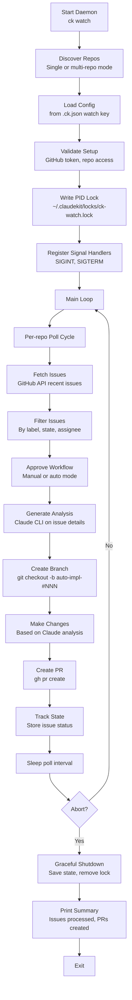
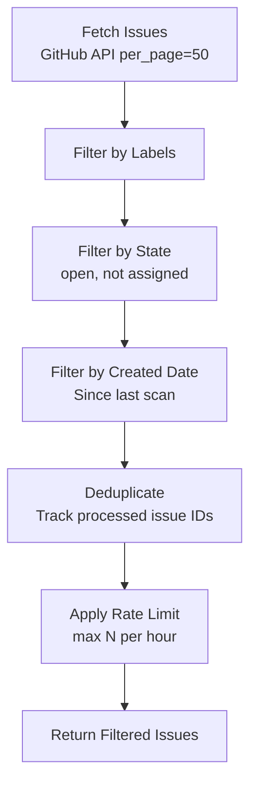
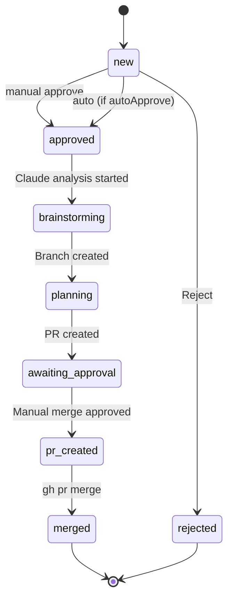

# ClaudeKit Watch Command (`ck watch`)

## Overview

`ck watch` is a GitHub issue monitoring daemon that automatically detects new issues with specific labels, generates AI-powered analysis and implementation plans via Claude CLI, and creates pull requests with proposed solutions. Designed for 6-8+ hour unattended overnight operation.

**Key Features:**
- Real-time GitHub issue polling (configurable intervals)
- Label-based filtering (e.g., "good-first-issue", "auto-implement")
- Multi-repo support with automatic repository discovery
- AI-powered issue analysis and implementation planning via Claude CLI
- Branch creation and pull request submission
- Approval workflow with manual/auto modes
- Rate limiting and graceful shutdown
- Process locking to prevent duplicate daemons

---

## Quick Start

```bash
# Start watch daemon (single or multi-repo)
ck watch

# With custom poll interval (milliseconds)
ck watch --interval 30000

# Dry-run: detect issues without posting PRs
ck watch --dry-run

# Force restart (kill existing instance)
ck watch --force

# Follow verbose logging
ck watch --verbose
```

---

## Architecture



---

## Repository Discovery

Watch supports both single-repo and multi-repo modes:

### Single-Repo Mode
When CWD is a git repository:
```bash
cd /path/to/my-project
ck watch
# Monitors only this repository
```

Uses `.git/config` to determine repo owner/name:
```
[remote "origin"]
    url = https://github.com/owner/repo-name.git
```

### Multi-Repo Mode
When CWD contains git subdirectories:
```bash
cd /path/to/projects-root
ck watch
# Scans for .git subdirs and monitors all found repos
```

Useful for monorepos or managing multiple projects overnight.

---

## Configuration

Watch is configured via `.ck.json` in project root:

```json
{
  "watch": {
    "enabled": true,
    "pollIntervalMs": 30000,
    "issueLabels": ["auto-implement", "good-first-issue"],
    "approvalMode": "manual",
    "maxIssuesPerHour": 5,
    "logMaxBytes": 5242880,
    "claudeCliPath": "ck",
    "branchPrefix": "auto-impl-",
    "prTemplate": "Fixes #{{issue_number}}\n\n{{analysis}}"
  }
}
```

### Configuration Fields

| Field | Type | Default | Purpose |
|-------|------|---------|---------|
| `enabled` | boolean | false | Enable/disable watch daemon |
| `pollIntervalMs` | number | 30000 | How often to check for new issues (ms) |
| `issueLabels` | string[] | [] | Only process issues with these labels |
| `approvalMode` | "manual" \| "auto" | "manual" | auto = create PR immediately, manual = wait for approval |
| `maxIssuesPerHour` | number | 5 | Rate limit: max issues to process per hour |
| `logMaxBytes` | number | 5242880 | Rotate logs when they exceed this size (5MB default) |
| `claudeCliPath` | string | "ck" | Path to Claude CLI executable |
| `branchPrefix` | string | "auto-impl-" | Prefix for auto-created branches |
| `prTemplate` | string | "{title}\n\n{analysis}" | Template for PR description |

---

## Issue Processing Flow

### 1. Issue Detection



**API Call:**
```bash
gh api repos/{owner}/{repo}/issues \
  --state=open \
  --labels=auto-implement \
  --sort=created \
  --direction=desc \
  --limit=50
```

**Filtering:**
- State: `open` only (skip closed, draft PRs)
- Labels: Exact match against configured labels
- Recently created: Skip if processed in this session
- Rate limit: Max 5 per hour (configurable)

### 2. Approval Workflow

#### Manual Mode (Default)
```
Issue detected → Status: "new" → Wait for human approval
ck watch approve #123
→ Status: "approved" → Proceed to analysis
```

#### Auto Mode
```
Issue detected → Status: "awaiting_approval" → Auto-approve → Status: "approved"
```

### 3. Analysis & Planning

Spawn Claude CLI with issue details:

```bash
echo "Issue: {title}
Description: {body}
Labels: {labels}

Analyze this GitHub issue and:
1. Understand the requirement
2. Identify implementation steps
3. Suggest code changes
4. Create a plan for a pull request" | ck --stream
```

Claude's response parsed for:
- **Understanding**: What the issue asks for
- **Implementation Steps**: Numbered list of changes
- **Code Plan**: Pseudo-code or actual code suggestions
- **PR Summary**: Brief summary for pull request

**State:** Issue → `"brainstorming"`

### 4. Branch & Implementation

```bash
# Create branch from main/master
git checkout main
git pull origin main
git checkout -b auto-impl-123

# Make changes based on analysis
# (actual implementation varies by issue type)

# Stage and commit
git add .
git commit -m "feat: Auto-implement issue #123

Based on AI analysis via ck watch daemon
Suggested implementation: [Claude analysis summary]"
```

**State:** Issue → `"planning"`

### 5. Pull Request Creation

```bash
gh pr create \
  --title "Auto-implement: {issue_title}" \
  --body "Fixes #{issue_number}

{claude_analysis_summary}

Generated by: ck watch daemon" \
  --head auto-impl-123 \
  --base main
```

**State:** Issue → `"awaiting_approval"`

Daemon waits for manual approval to merge PR.

---

## Rate Limiting

### Per-Hour Limits

```json
"maxIssuesPerHour": 5
```

Prevents overwhelming the system:
- Tracks issues processed in current hour
- Hour resets at top of each hour (UTC)
- If limit reached, daemon continues polling but skips processing

**Example Log:**
```
[12:45] Processed issue #42 (2/5 this hour)
[12:50] Processed issue #43 (3/5 this hour)
[12:55] Issue #44 detected but rate limit reached (5/5 this hour)
```

### GitHub API Rate Limits

Respects GitHub's rate limits:
- **Unauthenticated**: 60 requests/hour
- **Authenticated**: 5,000 requests/hour

Watch uses `gh auth token` for higher limits. Check status:
```bash
gh api rate_limit
```

---

## State Management

Runtime state persisted at `~/.claudekit/watch.state.json`:

```typescript
interface WatchState {
  lastScanAt: string;           // ISO 8601 of last poll
  activeIssues: {
    [issueNumber: string]: {
      number: number;
      status: "new" | "approved" | "brainstorming" | "planning" | "awaiting_approval" | "pr_created" | "merged" | "rejected";
      title: string;
      prNumber?: number;
      prUrl?: string;
      createdAt: string;
      updatedAt: string;
      branchName: string;
    }
  };
  currentlyImplementing: number | null;  // Currently being implemented
}
```

**State Transitions:**



---

## Plan Directory Resolution

Watch integrates with ClaudeKit's plan system:

### Detection
When an issue mentions `.claude/plans/` or references a plan:
```
Fixes #123

Related to plan: plans/260305-1300-feature-name/
```

Watch resolves the plan directory and can:
1. Extract existing requirements
2. Add implementation progress
3. Create/update phase files based on analysis

### Configuration
```json
"planDirPattern": "plans/\\d+-\\d+-[a-z-]+/",
"updatePlansOnImplementation": true
```

---

## Graceful Shutdown

Watch respects shutdown signals for long-running operations:

### SIGINT / SIGTERM
```bash
# Keyboard interrupt (Ctrl+C) or system shutdown
# Handler saves state and exits cleanly
```

**Shutdown Sequence:**
1. Set `abortRequested = true` flag
2. Allow current issue to finish processing
3. Revert any in-progress states to "awaiting_approval"
4. Save state file atomically
5. Remove PID lock file
6. Print summary stats
7. Exit cleanly

**Prevents:**
- Orphaned branches
- Partial PR submissions
- State corruption

---

## Process Locking

Watch uses process locking to prevent multiple instances:

```bash
# Lock file location
~/.claudekit/locks/ck-watch.lock

# Contents: process ID
12345
```

**Startup Check:**
```
If lock file exists:
  → Read PID
  → Check if process still running (ps -p PID)
  → If running: error "Another instance detected. Use --force to override"
  → If dead: remove stale lock, proceed
```

**Usage:**
```bash
# Kill existing and start fresh
ck watch --force
```

---

## Logging

Watch logs to `~/.claudekit/logs/watch-YYYYMMDD.log`:

### Log Levels

- **INFO**: Poll cycles, issues detected, PRs created
- **WARN**: Rate limits, approval pending, API issues
- **ERROR**: GitHub API errors, CLI failures

### Log Rotation

- Daily files by date (watch-20250305.log)
- Rotate when file exceeds `logMaxBytes` (5MB default)
- Backup rotated logs: `watch-20250305.log.1`, `.log.2`, etc.

### Verbose Mode

```bash
ck watch --verbose
```

Includes:
- Full API responses (for debugging)
- Claude CLI prompts and outputs
- Git command execution details
- Timing information per phase

---

## Troubleshooting

### Daemon Won't Start

```bash
# Check for stale lock
ls ~/.claudekit/locks/ck-watch.lock

# Check GitHub credentials
gh auth status

# Validate repo access
gh repo view  # from project directory
```

### Issues Not Detected

```bash
# Verify label name exactly matches config
ck watch --verbose  # check logs for API responses

# Check rate limit not hit
gh api rate_limit

# Verify issue state (must be open, not draft)
gh issue list  # should show issues
```

### PR Creation Fails

```bash
# Test gh CLI
gh pr create --dry-run

# Check git status
git status

# Verify main branch exists
git branch -a

# Check push permissions
git push origin --dry-run
```

### Claude Analysis Not Working

```bash
# Test Claude CLI
echo "test" | ck --stream

# Check PATH
which ck

# Verify ck binary works
ck --version
```

---

## Examples

### Monitor Single Repository

```bash
cd ~/my-project
ck watch
# Monitors ~/my-project only
```

### Monitor Multiple Repositories

```bash
cd ~/projects
ck watch
# Scans for .git subdirectories:
# - ~/projects/repo-a/.git
# - ~/projects/repo-b/.git
# - ~/projects/repo-c/.git
# Monitors all three
```

### Custom Poll Interval

```bash
# Check every 15 seconds (for testing)
ck watch --interval 15000

# Check every 5 minutes (production)
ck watch --interval 300000
```

### Dry-Run Mode

```bash
# Detect issues but don't create PRs
ck watch --dry-run

# Check logs to see what would be created
ck watch --dry-run --verbose
```

### Manual Approval Workflow

```bash
# Start daemon
ck watch &

# Check detected issues
sleep 30
ck watch status  # (future: show pending approvals)

# Check logs for pending issues
tail ~/.claudekit/logs/watch-*.log

# Approve specific issue
ck watch approve 123

# Reject issue
ck watch reject 123 --reason "Out of scope"
```

### Force Restart

```bash
# Kill existing daemon and start fresh
ck watch --force --verbose
```

---

## Advanced Configuration

### Custom PR Templates

```json
"prTemplate": "## Summary\nFixes #{issue_number}\n\n## Analysis\n{analysis}\n\n## Changes\n- {changes}\n\nAuto-created by ck watch"
```

**Template Variables:**
- `{issue_number}` - GitHub issue number
- `{issue_title}` - Original issue title
- `{analysis}` - Claude's analysis summary
- `{changes}` - List of code changes
- `{branchName}` - Created branch name

### Custom Branch Prefix

```json
"branchPrefix": "fix/"
```

Results in: `fix-#123-issue-title`

### Filter by Multiple Labels

```json
"issueLabels": ["good-first-issue", "auto-implement", "type:feature"]
```

Issue must have ALL labels to match.

### Auto-Approval Mode

```json
"approvalMode": "auto"
```

All detected issues automatically proceed to analysis without waiting.

---

## Related Documentation

- **Main Command Guide**: `./ck-command-flow-guide.md` - CLI overview
- **Content Command**: `./ck-content.md` - Multi-channel content automation
- **System Architecture**: `./system-architecture.md` - Technical design
