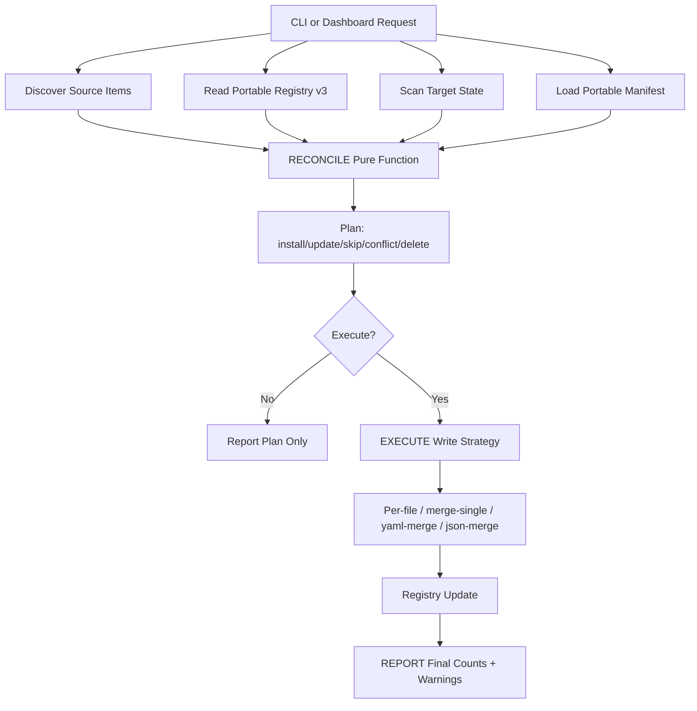

# Reconciliation Architecture

## Purpose

`ck migrate` now runs as a deterministic 3-phase pipeline:

1. `RECONCILE`: pure planning (no writes)
2. `EXECUTE`: apply plan with conflict policies
3. `REPORT`: summarize installs/updates/skips/failures

This doc is the high-level architecture reference for the idempotent migration system added in PR #413.

## End-to-End Flow

## Phase Contracts

### RECONCILE

- Input:
  - Source portable items
  - Registry entries (`portable-registry.json` v3)
  - Current target checksums/state
  - Optional manifest migrations/renames
- Output:
  - `ReconcilePlan` with action list + summary + conflict flag
- Guarantees:
  - no I/O side effects
  - deterministic for identical inputs

### EXECUTE

- Applies selected actions with provider strategy-aware installers.
- Conflict resolution policy:
  - interactive CLI: prompt (`overwrite`, `keep`, `show-diff`)
  - non-interactive: safe default is `keep`
- Atomicity safeguards:
  - file snapshots before writes
  - rollback on registry write failure
  - skill directory backup/restore on failure

### REPORT

- Emits summary counts:
  - `installed`, `skipped`, `failed`
- Includes warnings and per-provider results for CLI + dashboard.

## Core Components

- `src/commands/portable/reconciler.ts`: pure decision engine
- `src/commands/portable/portable-registry.ts`: registry v3 + migration + locking
- `src/commands/portable/portable-manifest.ts`: renames/path migrations evolution model
- `src/commands/portable/portable-installer.ts`: execution strategies + rollback
- `src/commands/migrate/skill-directory-installer.ts`: directory install + rollback
- `src/domains/web-server/routes/migration-routes.ts`: dashboard API entrypoints

## Decision Matrix (High-Level)

For each `(provider,type,item)` tuple, reconciler classifies:

- New source item not in registry -> `install`
- Source unchanged + target unchanged -> `skip`
- Source changed + target unchanged -> `update`
- Source unchanged + target changed by user -> `skip` (preserve user)
- Source changed + target changed -> `conflict`
- Target missing + source changed -> `install` (recreate)
- Target missing + source unchanged -> `skip`
- Registry orphan not in source (non-skill) -> `delete`

## Security + Safety Notes

- SHA-256 checksums for source/target drift.
- Path traversal hardening on manifest and installer paths.
- ANSI/control-code sanitization for diff and plan displays.
- Registry locking for concurrent safety.
- Rollback on write-before-registry failure paths.

## Known Limitations and Follow-Ups

- Plan execution endpoint may be disabled in some builds (returns `501`) and is surfaced in UI during review/execute.
- Skill orphan cleanup is intentionally conservative because skills are directory-based and not mapped 1:1 with source item files.
- File checksuming is read-all-at-once today; streaming hash for very large files can be a future optimization.
