# System Architecture
# ClaudeKit CLI

**Version:** 1.0
**Date:** 2025-10-08
**Status:** Production Ready
**Runtime:** Bun v1.x+
**Language:** TypeScript 5.x+

---

## Table of Contents

1. [Architecture Overview](#architecture-overview)
2. [Component Architecture](#component-architecture)
3. [Data Flow Diagrams](#data-flow-diagrams)
4. [Authentication Flow](#authentication-flow)
5. [Download and Extraction Flow](#download-and-extraction-flow)
6. [File Merging Flow](#file-merging-flow)
7. [Technology Stack](#technology-stack)
8. [Module Dependencies](#module-dependencies)
9. [Error Handling Architecture](#error-handling-architecture)
10. [Security Architecture](#security-architecture)

---

## Architecture Overview

### High-Level Architecture

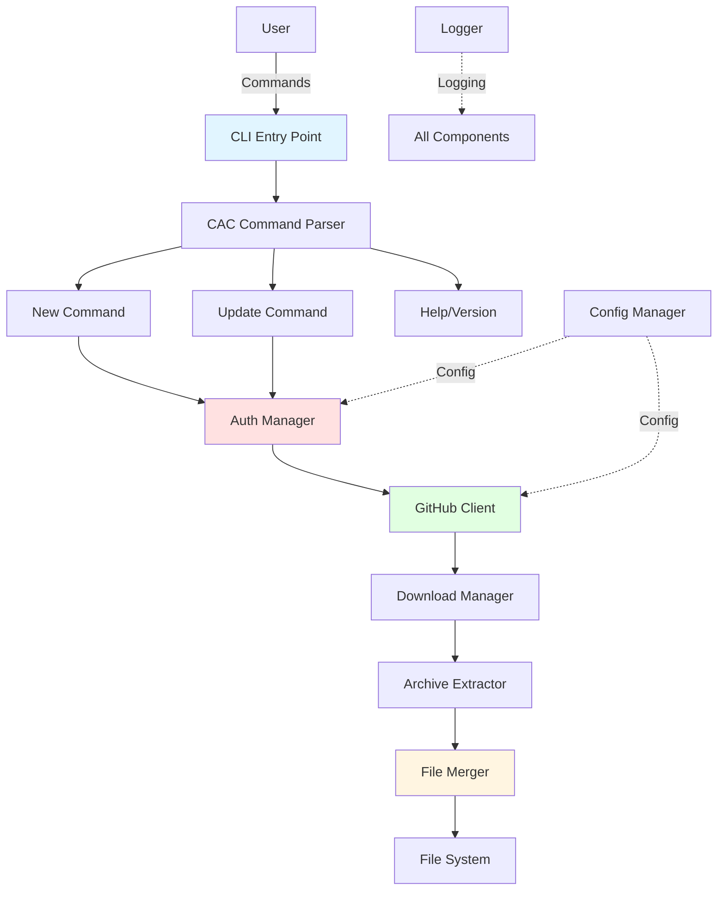
```mermaid
graph TB
    User[User] -->|Commands| CLI[CLI Entry Point]
    CLI --> Parser[CAC Command Parser]

    Parser --> NewCmd[New Command]
    Parser --> UpdateCmd[Update Command]
    Parser --> HelpCmd[Help/Version]

    NewCmd --> Auth[Auth Manager]
    UpdateCmd --> Auth

    Auth --> GH[GitHub Client]
    GH --> DL[Download Manager]
    DL --> Extract[Archive Extractor]
    Extract --> Merge[File Merger]

    Merge --> FS[File System]

    Config[Config Manager] -.->|Config| Auth
    Config -.->|Config| GH
    Logger[Logger] -.->|Logging| All[All Components]

    style CLI fill:#e1f5ff
    style Auth fill:#ffe1e1
    style GH fill:#e1ffe1
    style Merge fill:#fff5e1
```

### Layered Architecture

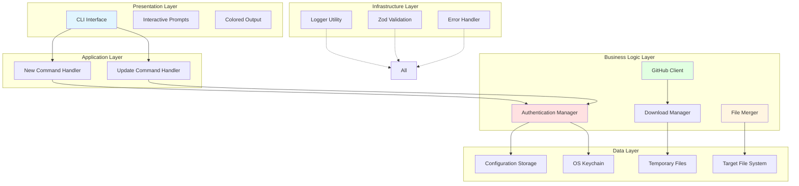
```mermaid
graph TD
    subgraph "Presentation Layer"
        CLI[CLI Interface]
        Prompts[Interactive Prompts]
        Output[Colored Output]
    end

    subgraph "Application Layer"
        NewCommand[New Command Handler]
        UpdateCommand[Update Command Handler]
    end

    subgraph "Business Logic Layer"
        Auth[Authentication Manager]
        GitHub[GitHub Client]
        Download[Download Manager]
        Merge[File Merger]
    end

    subgraph "Data Layer"
        Config[Configuration Storage]
        Keychain[OS Keychain]
        TempFiles[Temporary Files]
        FileSystem[Target File System]
    end

    subgraph "Infrastructure Layer"
        Logger[Logger Utility]
        Validation[Zod Validation]
        ErrorHandler[Error Handler]
    end

    CLI --> NewCommand
    CLI --> UpdateCommand
    NewCommand --> Auth
    UpdateCommand --> Auth
    Auth --> Config
    Auth --> Keychain
    GitHub --> Download
    Download --> TempFiles
    Merge --> FileSystem

    Logger -.-> All
    Validation -.-> All
    ErrorHandler -.-> All

    style CLI fill:#e1f5ff
    style Auth fill:#ffe1e1
    style GitHub fill:#e1ffe1
    style Merge fill:#fff5e1
```

---

## Component Architecture

### Core Components

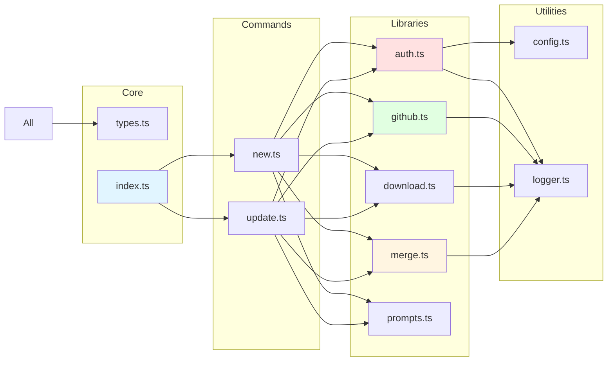
```mermaid
graph LR
    subgraph "Commands"
        New[new.ts]
        Update[update.ts]
    end

    subgraph "Libraries"
        Auth[auth.ts]
        GitHub[github.ts]
        Download[download.ts]
        Merge[merge.ts]
        Prompts[prompts.ts]
    end

    subgraph "Utilities"
        Config[config.ts]
        Logger[logger.ts]
    end

    subgraph "Core"
        Types[types.ts]
        Index[index.ts]
    end

    Index --> New
    Index --> Update

    New --> Auth
    New --> GitHub
    New --> Download
    New --> Merge
    New --> Prompts

    Update --> Auth
    Update --> GitHub
    Update --> Download
    Update --> Merge
    Update --> Prompts

    Auth --> Config
    Auth --> Logger
    GitHub --> Logger
    Download --> Logger
    Merge --> Logger

    All --> Types

    style Index fill:#e1f5ff
    style Auth fill:#ffe1e1
    style GitHub fill:#e1ffe1
    style Merge fill:#fff5e1
```

### Module Responsibilities

| Module | Responsibility | Size | Status |
|--------|---------------|------|--------|
| **index.ts** | CLI entry point, command routing | 47 lines | ✅ Complete |
| **types.ts** | Type definitions, Zod schemas, error classes | 146 lines | ✅ Complete |
| **auth.ts** | Multi-tier authentication, token management | 152 lines | ✅ Complete |
| **github.ts** | GitHub API client, release fetching | 149 lines | ✅ Complete |
| **download.ts** | Streaming downloads, progress tracking | 178 lines | ✅ Complete |
| **merge.ts** | File merging, conflict detection | 117 lines | ✅ Complete |
| **prompts.ts** | Interactive user prompts | 114 lines | ✅ Complete |
| **config.ts** | Configuration management | 84 lines | ✅ Complete |
| **logger.ts** | Logging with sanitization | 38 lines | ✅ Complete |
| **new.ts** | New project command | 118 lines | ✅ Complete |
| **update.ts** | Update project command | 115 lines | ✅ Complete |

---

## Data Flow Diagrams

### New Project Flow

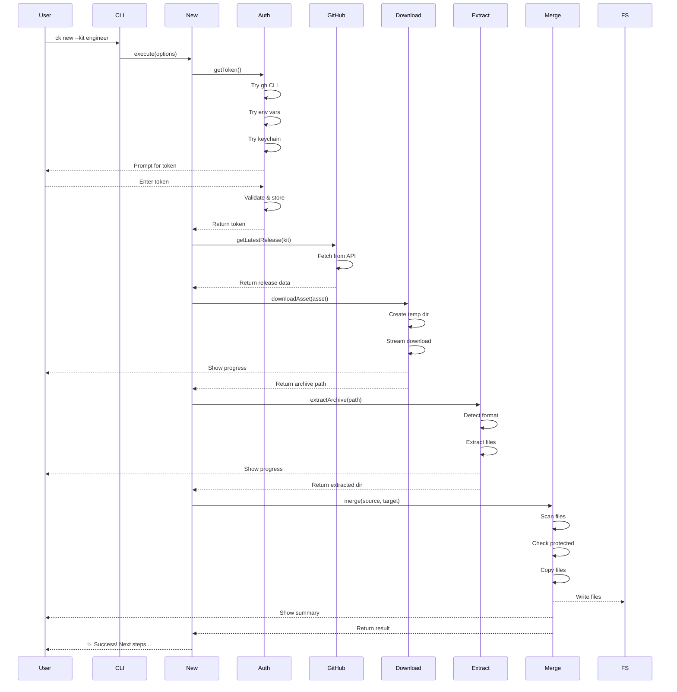
```mermaid
sequenceDiagram
    participant User
    participant CLI
    participant New
    participant Auth
    participant GitHub
    participant Download
    participant Extract
    participant Merge
    participant FS

    User->>CLI: ck new --kit engineer
    CLI->>New: execute(options)

    New->>Auth: getToken()
    Auth->>Auth: Try gh CLI
    Auth->>Auth: Try env vars
    Auth->>Auth: Try keychain
    Auth-->>User: Prompt for token
    User-->>Auth: Enter token
    Auth->>Auth: Validate & store
    Auth-->>New: Return token

    New->>GitHub: getLatestRelease(kit)
    GitHub->>GitHub: Fetch from API
    GitHub-->>New: Return release data

    New->>Download: downloadAsset(asset)
    Download->>Download: Create temp dir
    Download->>Download: Stream download
    Download-->>User: Show progress
    Download-->>New: Return archive path

    New->>Extract: extractArchive(path)
    Extract->>Extract: Detect format
    Extract->>Extract: Extract files
    Extract-->>User: Show progress
    Extract-->>New: Return extracted dir

    New->>Merge: merge(source, target)
    Merge->>Merge: Scan files
    Merge->>Merge: Check protected
    Merge->>Merge: Copy files
    Merge-->>FS: Write files
    Merge-->>User: Show summary
    Merge-->>New: Return result

    New-->>User: ✨ Success! Next steps...
```

### Update Project Flow

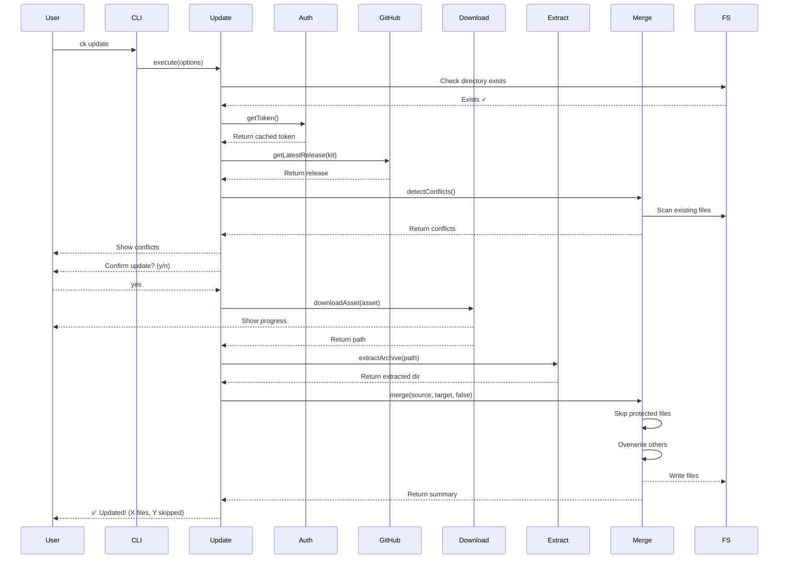
```mermaid
sequenceDiagram
    participant User
    participant CLI
    participant Update
    participant Auth
    participant GitHub
    participant Download
    participant Extract
    participant Merge
    participant FS

    User->>CLI: ck update
    CLI->>Update: execute(options)

    Update->>FS: Check directory exists
    FS-->>Update: Exists ✓

    Update->>Auth: getToken()
    Auth-->>Update: Return cached token

    Update->>GitHub: getLatestRelease(kit)
    GitHub-->>Update: Return release

    Update->>Merge: detectConflicts()
    Merge->>FS: Scan existing files
    Merge-->>Update: Return conflicts

    Update-->>User: Show conflicts
    Update-->>User: Confirm update? (y/n)
    User-->>Update: yes

    Update->>Download: downloadAsset(asset)
    Download-->>User: Show progress
    Download-->>Update: Return path

    Update->>Extract: extractArchive(path)
    Extract-->>Update: Return extracted dir

    Update->>Merge: merge(source, target, false)
    Merge->>Merge: Skip protected files
    Merge->>Merge: Overwrite others
    Merge-->>FS: Write files
    Merge-->>Update: Return summary

    Update-->>User: ✅ Updated! (X files, Y skipped)
```

---

## Authentication Flow

### Multi-Tier Fallback

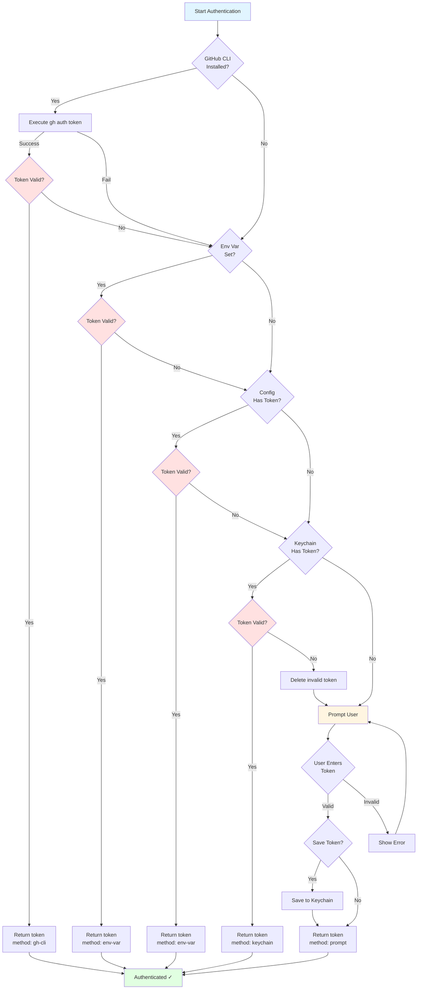
```mermaid
graph TD
    Start[Start Authentication] --> CheckGH{GitHub CLI<br/>Installed?}

    CheckGH -->|Yes| TryGH[Execute gh auth token]
    CheckGH -->|No| CheckEnv

    TryGH -->|Success| ValidateGH{Token Valid?}
    TryGH -->|Fail| CheckEnv

    ValidateGH -->|Yes| ReturnGH[Return token<br/>method: gh-cli]
    ValidateGH -->|No| CheckEnv

    CheckEnv{Env Var<br/>Set?} -->|Yes| ValidateEnv{Token Valid?}
    CheckEnv -->|No| CheckConfig

    ValidateEnv -->|Yes| ReturnEnv[Return token<br/>method: env-var]
    ValidateEnv -->|No| CheckConfig

    CheckConfig{Config<br/>Has Token?} -->|Yes| ValidateConfig{Token Valid?}
    CheckConfig -->|No| CheckKeychain

    ValidateConfig -->|Yes| ReturnConfig[Return token<br/>method: env-var]
    ValidateConfig -->|No| CheckKeychain

    CheckKeychain{Keychain<br/>Has Token?} -->|Yes| ValidateKeychain{Token Valid?}
    CheckKeychain -->|No| Prompt

    ValidateKeychain -->|Yes| ReturnKeychain[Return token<br/>method: keychain]
    ValidateKeychain -->|No| DeleteKeychain[Delete invalid token]
    DeleteKeychain --> Prompt

    Prompt[Prompt User] --> UserInput{User Enters<br/>Token}

    UserInput -->|Valid| AskSave{Save Token?}
    UserInput -->|Invalid| ShowError[Show Error]
    ShowError --> Prompt

    AskSave -->|Yes| SaveKeychain[Save to Keychain]
    AskSave -->|No| ReturnPrompt

    SaveKeychain --> ReturnPrompt[Return token<br/>method: prompt]

    ReturnGH --> End[Authenticated ✓]
    ReturnEnv --> End
    ReturnConfig --> End
    ReturnKeychain --> End
    ReturnPrompt --> End

    style Start fill:#e1f5ff
    style End fill:#e1ffe1
    style Prompt fill:#fff5e1
    style ValidateGH fill:#ffe1e1
    style ValidateEnv fill:#ffe1e1
    style ValidateConfig fill:#ffe1e1
    style ValidateKeychain fill:#ffe1e1
```

### Token Validation Flow

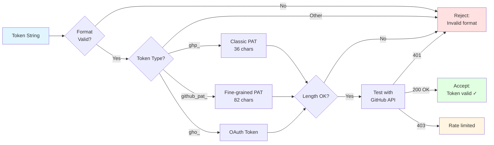
```mermaid
graph LR
    Token[Token String] --> Format{Format<br/>Valid?}

    Format -->|No| Invalid[Reject:<br/>Invalid format]
    Format -->|Yes| Type{Token Type?}

    Type -->|ghp_| Classic[Classic PAT<br/>36 chars]
    Type -->|github_pat_| FineGrained[Fine-grained PAT<br/>82 chars]
    Type -->|gho_| OAuth[OAuth Token]
    Type -->|Other| Invalid

    Classic --> Length{Length OK?}
    FineGrained --> Length
    OAuth --> Length

    Length -->|No| Invalid
    Length -->|Yes| APITest[Test with<br/>GitHub API]

    APITest -->|200 OK| Valid[Accept:<br/>Token valid ✓]
    APITest -->|401| Invalid
    APITest -->|403| RateLimit[Rate limited]

    style Token fill:#e1f5ff
    style Valid fill:#e1ffe1
    style Invalid fill:#ffe1e1
    style RateLimit fill:#fff5e1
```

---

## Download and Extraction Flow

### Download Process

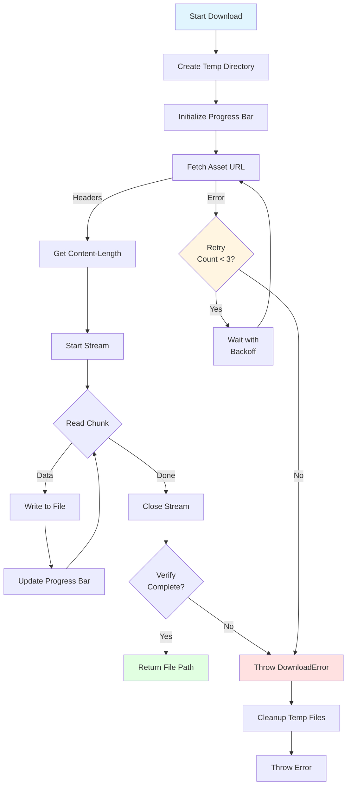
```mermaid
graph TD
    Start[Start Download] --> CreateTemp[Create Temp Directory]
    CreateTemp --> InitProgress[Initialize Progress Bar]

    InitProgress --> Fetch[Fetch Asset URL]
    Fetch -->|Headers| GetSize[Get Content-Length]
    GetSize --> StartStream[Start Stream]

    StartStream --> ReadChunk{Read Chunk}
    ReadChunk -->|Data| WriteChunk[Write to File]
    WriteChunk --> UpdateProgress[Update Progress Bar]
    UpdateProgress --> ReadChunk

    ReadChunk -->|Done| CloseStream[Close Stream]
    CloseStream --> Verify{Verify<br/>Complete?}

    Verify -->|Yes| Success[Return File Path]
    Verify -->|No| Error[Throw DownloadError]

    Fetch -->|Error| Retry{Retry<br/>Count < 3?}
    Retry -->|Yes| Wait[Wait with<br/>Backoff]
    Wait --> Fetch
    Retry -->|No| Error

    Error --> Cleanup[Cleanup Temp Files]
    Cleanup --> Fail[Throw Error]

    style Start fill:#e1f5ff
    style Success fill:#e1ffe1
    style Error fill:#ffe1e1
    style Retry fill:#fff5e1
```

### Archive Extraction

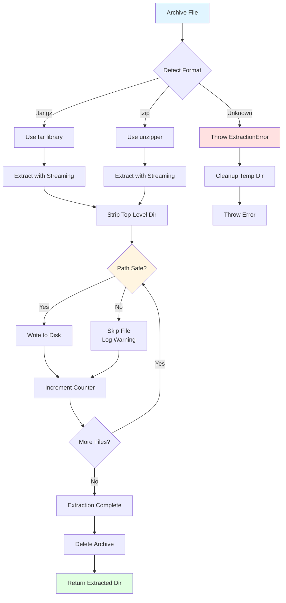
```mermaid
graph TD
    Start[Archive File] --> Detect{Detect Format}

    Detect -->|.tar.gz| UseTar[Use tar library]
    Detect -->|.zip| UseUnzip[Use unzipper]
    Detect -->|Unknown| Error[Throw ExtractionError]

    UseTar --> ExtractTar[Extract with Streaming]
    UseUnzip --> ExtractZip[Extract with Streaming]

    ExtractTar --> Strip[Strip Top-Level Dir]
    ExtractZip --> Strip

    Strip --> CheckPath{Path Safe?}

    CheckPath -->|No| Skip[Skip File<br/>Log Warning]
    CheckPath -->|Yes| Write[Write to Disk]

    Write --> Count[Increment Counter]
    Skip --> Count

    Count --> More{More Files?}
    More -->|Yes| CheckPath
    More -->|No| Complete[Extraction Complete]

    Complete --> CleanupArchive[Delete Archive]
    CleanupArchive --> Success[Return Extracted Dir]

    Error --> Cleanup[Cleanup Temp Dir]
    Cleanup --> Fail[Throw Error]

    style Start fill:#e1f5ff
    style Success fill:#e1ffe1
    style Error fill:#ffe1e1
    style CheckPath fill:#fff5e1
```

---

## File Merging Flow

### Conflict Detection

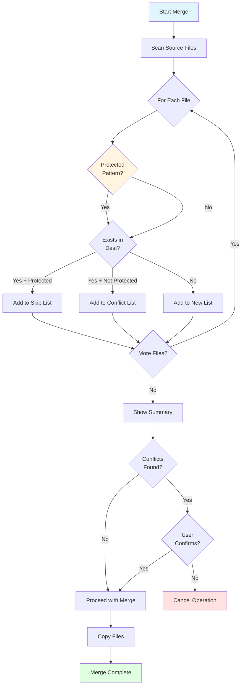
```mermaid
graph TD
    Start[Start Merge] --> Scan[Scan Source Files]

    Scan --> CheckFile{For Each File}

    CheckFile --> CheckProtected{Protected<br/>Pattern?}

    CheckProtected -->|Yes| DestExists{Exists in<br/>Dest?}
    CheckProtected -->|No| DestExists

    DestExists -->|Yes + Protected| AddSkip[Add to Skip List]
    DestExists -->|Yes + Not Protected| AddConflict[Add to Conflict List]
    DestExists -->|No| AddNew[Add to New List]

    AddSkip --> NextFile{More Files?}
    AddConflict --> NextFile
    AddNew --> NextFile

    NextFile -->|Yes| CheckFile
    NextFile -->|No| ShowSummary[Show Summary]

    ShowSummary --> HasConflicts{Conflicts<br/>Found?}

    HasConflicts -->|Yes| Confirm{User<br/>Confirms?}
    HasConflicts -->|No| Proceed

    Confirm -->|Yes| Proceed[Proceed with Merge]
    Confirm -->|No| Cancel[Cancel Operation]

    Proceed --> CopyFiles[Copy Files]
    CopyFiles --> Complete[Merge Complete]

    style Start fill:#e1f5ff
    style Complete fill:#e1ffe1
    style Cancel fill:#ffe1e1
    style CheckProtected fill:#fff5e1
```

### Protected File Patterns

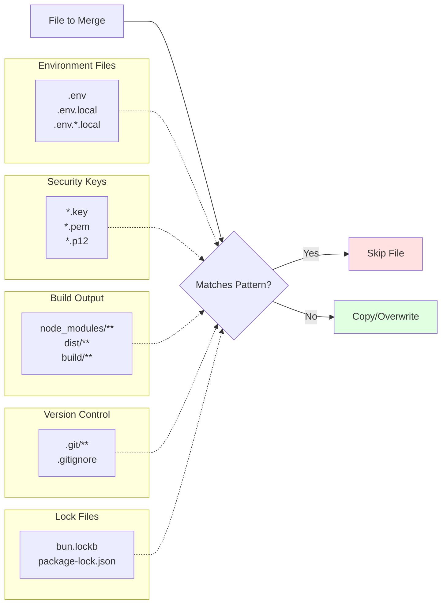
```mermaid
graph LR
    subgraph "Environment Files"
        ENV[.env<br/>.env.local<br/>.env.*.local]
    end

    subgraph "Security Keys"
        KEYS[*.key<br/>*.pem<br/>*.p12]
    end

    subgraph "Build Output"
        BUILD[node_modules/**<br/>dist/**<br/>build/**]
    end

    subgraph "Version Control"
        VCS[.git/**<br/>.gitignore]
    end

    subgraph "Lock Files"
        LOCK[bun.lockb<br/>package-lock.json]
    end

    File[File to Merge] --> Check{Matches Pattern?}

    ENV -.-> Check
    KEYS -.-> Check
    BUILD -.-> Check
    VCS -.-> Check
    LOCK -.-> Check

    Check -->|Yes| Skip[Skip File]
    Check -->|No| Copy[Copy/Overwrite]

    style Skip fill:#ffe1e1
    style Copy fill:#e1ffe1
```

---

## Technology Stack

### Runtime and Language

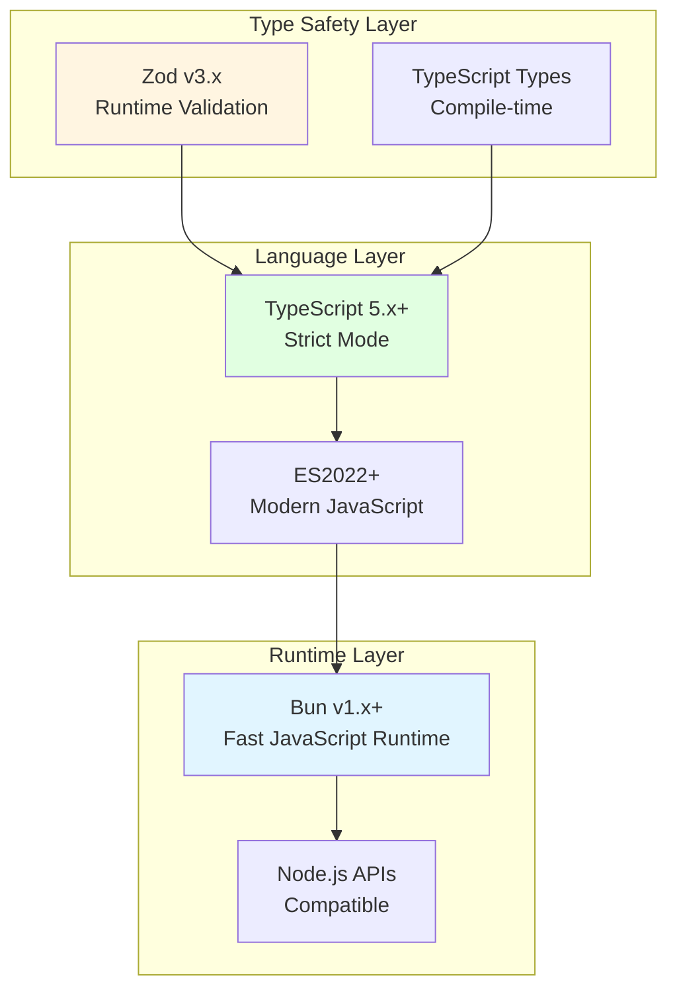
```mermaid
graph TB
    subgraph "Runtime Layer"
        Bun[Bun v1.x+<br/>Fast JavaScript Runtime]
        Node[Node.js APIs<br/>Compatible]
    end

    subgraph "Language Layer"
        TS[TypeScript 5.x+<br/>Strict Mode]
        ES[ES2022+<br/>Modern JavaScript]
    end

    subgraph "Type Safety Layer"
        Zod[Zod v3.x<br/>Runtime Validation]
        Types[TypeScript Types<br/>Compile-time]
    end

    Bun --> Node
    TS --> ES
    ES --> Bun
    Zod --> TS
    Types --> TS

    style Bun fill:#e1f5ff
    style TS fill:#e1ffe1
    style Zod fill:#fff5e1
```

### Core Dependencies

```mermaid
graph TB
    subgraph "CLI Framework"
        CAC[cac<br/>Command Parser]
        Clack[clack/prompts<br/>Interactive Prompts]
        Ora[ora<br/>Spinners]
        Progress[cli-progress<br/>Progress Bars]
        Colors[picocolors<br/>Colors]
    end

    subgraph "GitHub Integration"
        Octokit[octokit/rest<br/>GitHub API]
        Keytar[keytar<br/>Credential Storage]
    end

    subgraph "File Operations"
        FSExtra[fs-extra<br/>File System]
        Tar[tar<br/>TAR Extraction]
        Unzipper[unzipper<br/>ZIP Extraction]
        Ignore[ignore<br/>Pattern Matching]
        Tmp[tmp<br/>Temp Files]
    end

    subgraph "Validation"
        Zod[zod<br/>Schema Validation]
    end

    App[ClaudeKit CLI] --> CAC
    App --> Clack
    App --> Ora
    App --> Progress
    App --> Colors
    App --> Octokit
    App --> Keytar
    App --> FSExtra
    App --> Tar
    App --> Unzipper
    App --> Ignore
    App --> Tmp
    App --> Zod

    style App fill:#e1f5ff
    style Octokit fill:#e1ffe1
    style Zod fill:#fff5e1
```

---

## Module Dependencies

### Dependency Graph

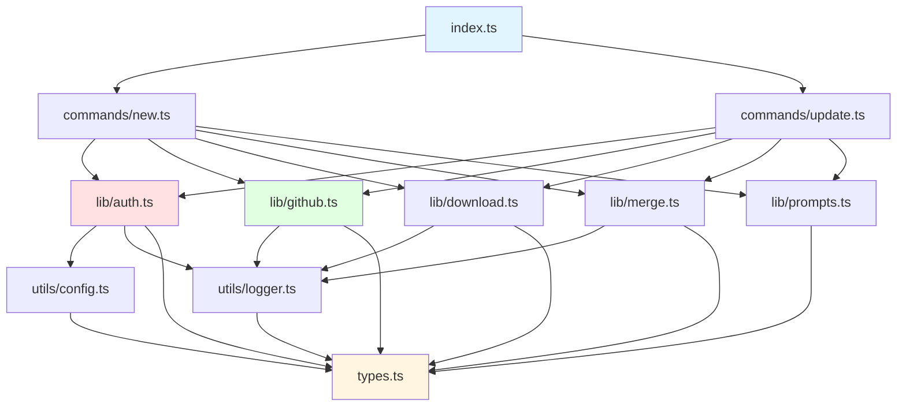
```mermaid
graph TD
    Index[index.ts] --> NewCmd[commands/new.ts]
    Index --> UpdateCmd[commands/update.ts]

    NewCmd --> Auth[lib/auth.ts]
    NewCmd --> GitHub[lib/github.ts]
    NewCmd --> Download[lib/download.ts]
    NewCmd --> Merge[lib/merge.ts]
    NewCmd --> Prompts[lib/prompts.ts]

    UpdateCmd --> Auth
    UpdateCmd --> GitHub
    UpdateCmd --> Download
    UpdateCmd --> Merge
    UpdateCmd --> Prompts

    Auth --> Config[utils/config.ts]
    Auth --> Logger[utils/logger.ts]
    Auth --> Types[types.ts]

    GitHub --> Logger
    GitHub --> Types

    Download --> Logger
    Download --> Types

    Merge --> Logger
    Merge --> Types

    Prompts --> Types

    Config --> Types
    Logger --> Types

    style Index fill:#e1f5ff
    style Types fill:#fff5e1
    style Auth fill:#ffe1e1
    style GitHub fill:#e1ffe1
```

### Import Hierarchy

**Level 1 (No Dependencies):**
- `types.ts` - Pure type definitions

**Level 2 (Depends on Level 1):**
- `utils/logger.ts` - Logging utility
- `utils/config.ts` - Configuration management

**Level 3 (Depends on Level 1-2):**
- `lib/auth.ts` - Authentication
- `lib/github.ts` - GitHub client
- `lib/download.ts` - Downloads
- `lib/merge.ts` - File merging
- `lib/prompts.ts` - User prompts

**Level 4 (Depends on Level 1-3):**
- `commands/new.ts` - New command
- `commands/update.ts` - Update command

**Level 5 (Entry Point):**
- `index.ts` - CLI entry point

---

## Error Handling Architecture

### Error Class Hierarchy

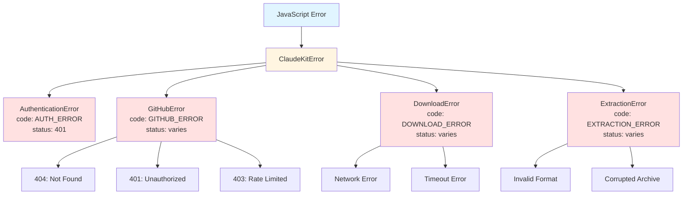
```mermaid
graph TD
    Error[JavaScript Error] --> CKError[ClaudeKitError]

    CKError --> AuthError[AuthenticationError<br/>code: AUTH_ERROR<br/>status: 401]
    CKError --> GitHubError[GitHubError<br/>code: GITHUB_ERROR<br/>status: varies]
    CKError --> DownloadError[DownloadError<br/>code: DOWNLOAD_ERROR<br/>status: varies]
    CKError --> ExtractionError[ExtractionError<br/>code: EXTRACTION_ERROR<br/>status: varies]

    GitHubError --> GH404[404: Not Found]
    GitHubError --> GH401[401: Unauthorized]
    GitHubError --> GH403[403: Rate Limited]

    DownloadError --> DLNetwork[Network Error]
    DownloadError --> DLTimeout[Timeout Error]

    ExtractionError --> EXFormat[Invalid Format]
    ExtractionError --> EXCorrupt[Corrupted Archive]

    style Error fill:#e1f5ff
    style CKError fill:#fff5e1
    style AuthError fill:#ffe1e1
    style GitHubError fill:#ffe1e1
    style DownloadError fill:#ffe1e1
    style ExtractionError fill:#ffe1e1
```

### Error Recovery Strategy

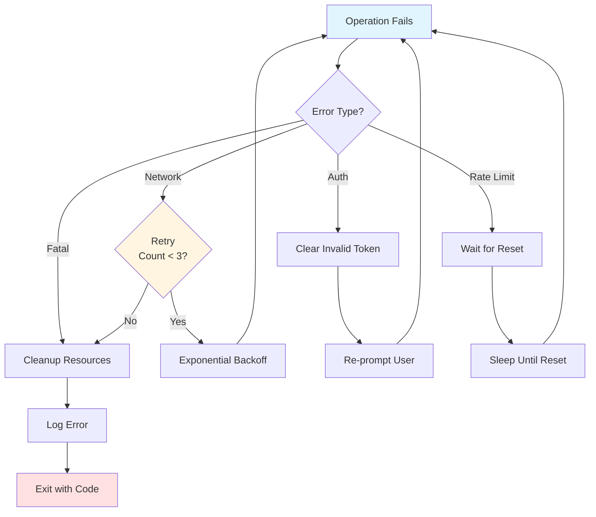
```mermaid
graph TD
    Operation[Operation Fails] --> Type{Error Type?}

    Type -->|Network| Retry{Retry<br/>Count < 3?}
    Type -->|Auth| ClearToken[Clear Invalid Token]
    Type -->|Rate Limit| Wait[Wait for Reset]
    Type -->|Fatal| Cleanup

    Retry -->|Yes| Backoff[Exponential Backoff]
    Retry -->|No| Cleanup

    Backoff --> Operation

    ClearToken --> Prompt[Re-prompt User]
    Prompt --> Operation

    Wait --> WaitTime[Sleep Until Reset]
    WaitTime --> Operation

    Cleanup[Cleanup Resources] --> Log[Log Error]
    Log --> Exit[Exit with Code]

    style Operation fill:#e1f5ff
    style Exit fill:#ffe1e1
    style Retry fill:#fff5e1
```

---

## Security Architecture

### Token Security

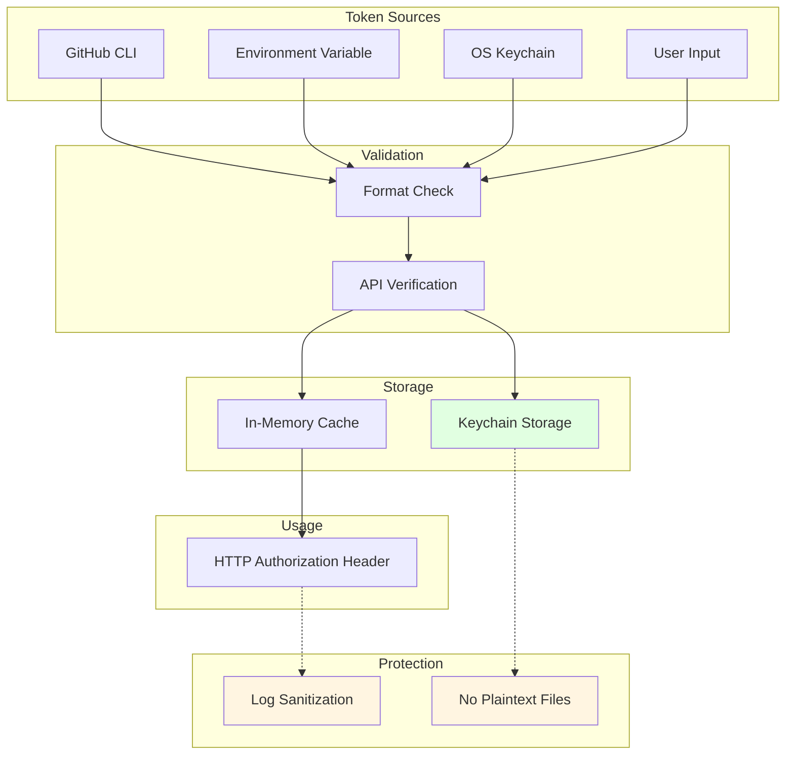
```mermaid
graph TB
    subgraph "Token Sources"
        GHCLI[GitHub CLI]
        EnvVar[Environment Variable]
        Keychain[OS Keychain]
        UserInput[User Input]
    end

    subgraph "Validation"
        Format[Format Check]
        API[API Verification]
    end

    subgraph "Storage"
        Memory[In-Memory Cache]
        SecureStore[Keychain Storage]
    end

    subgraph "Usage"
        HTTPHeader[HTTP Authorization Header]
    end

    subgraph "Protection"
        Sanitize[Log Sanitization]
        NoPlaintext[No Plaintext Files]
    end

    GHCLI --> Format
    EnvVar --> Format
    Keychain --> Format
    UserInput --> Format

    Format --> API
    API --> Memory
    API --> SecureStore

    Memory --> HTTPHeader

    HTTPHeader -.-> Sanitize
    SecureStore -.-> NoPlaintext

    style SecureStore fill:#e1ffe1
    style Sanitize fill:#fff5e1
    style NoPlaintext fill:#fff5e1
```

### Data Flow Security

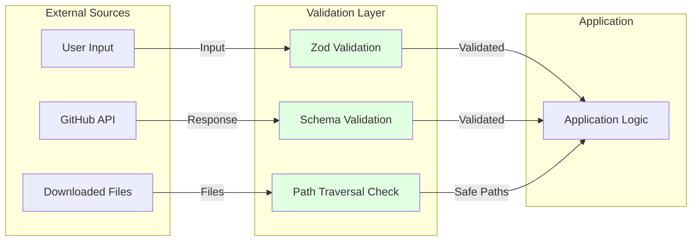
```mermaid
graph LR
    subgraph "External Sources"
        User[User Input]
        API[GitHub API]
        Download[Downloaded Files]
    end

    subgraph "Validation Layer"
        ZodUser[Zod Validation]
        ZodAPI[Schema Validation]
        PathCheck[Path Traversal Check]
    end

    subgraph "Application"
        App[Application Logic]
    end

    User -->|Input| ZodUser
    API -->|Response| ZodAPI
    Download -->|Files| PathCheck

    ZodUser -->|Validated| App
    ZodAPI -->|Validated| App
    PathCheck -->|Safe Paths| App

    style ZodUser fill:#e1ffe1
    style ZodAPI fill:#e1ffe1
    style PathCheck fill:#e1ffe1
```

---

## Performance Characteristics

### Memory Profile

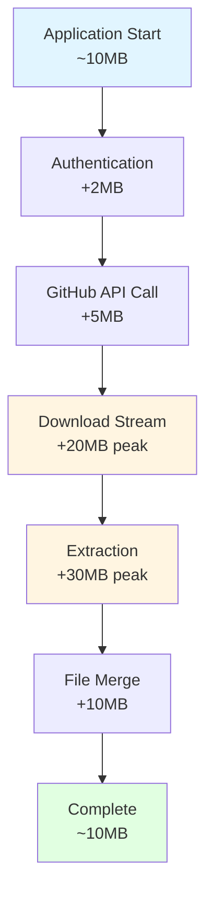
```mermaid
graph TB
    Start[Application Start<br/>~10MB] --> Auth[Authentication<br/>+2MB]
    Auth --> GitHub[GitHub API Call<br/>+5MB]
    GitHub --> Download[Download Stream<br/>+20MB peak]
    Download --> Extract[Extraction<br/>+30MB peak]
    Extract --> Merge[File Merge<br/>+10MB]
    Merge --> Complete[Complete<br/>~10MB]

    style Start fill:#e1f5ff
    style Download fill:#fff5e1
    style Extract fill:#fff5e1
    style Complete fill:#e1ffe1
```

### Execution Timeline

```mermaid
gantt
    title ClaudeKit CLI Execution Timeline (New Project)
    dateFormat X
    axisFormat %S.%Ls

    section Startup
    CLI Init           :0, 100ms
    Parse Args         :100, 50ms

    section Auth
    Detect gh CLI      :150, 200ms
    Token Validation   :350, 100ms

    section GitHub
    API Request        :450, 300ms
    Parse Response     :750, 50ms

    section Download
    Fetch Asset        :800, 5000ms
    Progress Tracking  :800, 5000ms

    section Extract
    Decompress         :5800, 2000ms
    Write Files        :7800, 1000ms

    section Merge
    Scan & Copy        :8800, 1000ms

    section Complete
    Cleanup & Summary  :9800, 200ms
```

---

## Deployment Architecture

### Distribution Methods

```mermaid
graph TB
    Source[Source Code] --> Build{Build Method}

    Build -->|bun build| Transpile[Transpiled JS]
    Build -->|bun build --compile| Binary[Standalone Binary]

    Transpile --> NPM[npm Registry]
    Binary --> Releases[GitHub Releases]

    NPM --> InstallNPM[bun add -g claudekit-cli]
    Releases --> InstallBinary[Download & Install]

    InstallNPM --> User1[User Machine]
    InstallBinary --> User2[User Machine]

    User1 --> Execute[ck command]
    User2 --> Execute

    style Source fill:#e1f5ff
    style Execute fill:#e1ffe1
    style NPM fill:#fff5e1
    style Releases fill:#fff5e1
```

---

**Document Version:** 1.0
**Last Updated:** 2025-10-08
**Status:** Production Ready
**Next Review:** 2025-11-08
