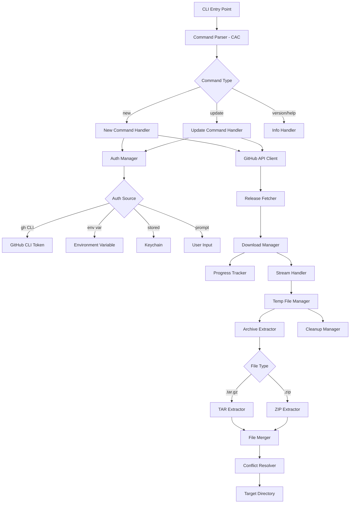

# ClaudeKit CLI Implementation Plan

**Date**: 2025-10-08
**Type**: Feature Implementation
**Status**: ✅ Code Review Complete - Production Ready
**Code Review**: See `./plans/reports/251008-from-code-reviewer-to-developer-review-report.md`
**Context**: Initial implementation of ClaudeKit CLI tool for bootstrapping and updating projects with private GitHub repository releases

## Executive Summary

ClaudeKit CLI (`ck`) is a command-line tool built with Bun and TypeScript that enables developers to quickly bootstrap new projects and update existing projects using releases from private GitHub repositories. The tool implements intelligent authentication fallback (GitHub CLI → environment variables → credential storage → user prompt), streaming downloads with progress tracking, smart file merging with conflict detection, and secure token management.

**Key Value Propositions:**
- Zero-configuration setup for users with GitHub CLI authentication
- Fast project initialization (leveraging Bun's performance)
- Safe updates with intelligent conflict resolution
- Secure token management using OS-native credential stores

## Context Links

- **Research Reports**:
  - `./plans/research/251008-cli-frameworks-bun-research.md` - CLI framework analysis
  - `./plans/reports/251008-researcher-github-api-report.md` - GitHub API integration
  - `./plans/reports/251008-researcher-download-extraction-report.md` - Download/extraction strategies
- **Related Projects**:
  - ClaudeKit Engineer: https://github.com/mrgoonie/claudekit-engineer (private)
  - ClaudeKit Marketing: [coming soon]
- **Reference Docs**: Will be created in `./docs` directory

## Requirements

### Functional Requirements

**Core Commands:**
- [ ] `ck new` - Bootstrap new project from release
  - [ ] Directory selection (default: current, prompt if not provided)
  - [ ] Kit selection (engineer, marketing [coming soon])
  - [ ] Version selection (default: latest)
  - [ ] Download and extract to target directory
  - [ ] Skip configuration files if they exist

- [ ] `ck update` - Update existing project
  - [ ] Directory selection (default: current)
  - [ ] Kit selection
  - [ ] Version selection (default: latest)
  - [ ] Confirmation prompt before overwriting
  - [ ] Smart merge with conflict detection
  - [ ] Backup option for existing files

- [ ] `ck --version` / `ck -v` - Show version information
- [ ] `ck --help` / `ck -h` - Display help information

**Authentication:**
- [ ] Detect and use GitHub CLI authentication
- [ ] Check environment variables (GITHUB_TOKEN, GH_TOKEN)
- [ ] Check stored credentials in OS keychain
- [ ] Prompt user for token with validation
- [ ] Securely store token with user consent

**Download & Extraction:**
- [ ] Fetch latest release by default
- [ ] Support specific version downloads
- [ ] Stream downloads with progress bar
- [ ] Support both .tar.gz and .zip formats
- [ ] Automatic format detection
- [ ] Show extraction progress

**File Management:**
- [ ] Smart file merging
- [ ] Protected file patterns (config files, .env, etc.)
- [ ] Path traversal protection
- [ ] Automatic cleanup of temporary files

### Non-Functional Requirements

**Performance:**
- [ ] Stream large files to avoid memory issues
- [ ] Use Bun's native APIs for optimal performance
- [ ] Parallel operations where possible
- [ ] Download speed ≥ 10MB/s on good connections

**Security:**
- [ ] Secure token storage using OS keychain
- [ ] Path traversal validation
- [ ] Input sanitization
- [ ] No token logging or exposure in errors
- [ ] Fine-grained PAT with minimal permissions

**Usability:**
- [ ] Clear progress indicators
- [ ] Helpful error messages
- [ ] Interactive prompts with validation
- [ ] Colorized output for better readability
- [ ] Graceful handling of interruptions

**Reliability:**
- [ ] Automatic retry with exponential backoff
- [ ] Rate limit handling
- [ ] Network error recovery
- [ ] Atomic operations (rollback on failure)
- [ ] Comprehensive error handling

**Maintainability:**
- [ ] TypeScript with strict mode
- [ ] Modular architecture
- [ ] Comprehensive JSDoc comments
- [ ] Unit test coverage ≥ 80%
- [ ] Clear separation of concerns

## Architecture Overview



### Key Components

**1. CLI Interface (`src/index.ts`)**
- Entry point with shebang for Bun runtime
- Command registration and routing
- Global error handling
- Version and help display

**2. Command Handlers (`src/commands/`)**
- `new.ts` - New project bootstrapping logic
- `update.ts` - Existing project update logic
- Shared validation and orchestration

**3. Authentication Manager (`src/lib/auth.ts`)**
- Multi-tier authentication fallback
- Token validation
- Secure storage integration
- GitHub CLI detection

**4. GitHub Client (`src/lib/github.ts`)**
- Octokit wrapper with retry logic
- Release listing and fetching
- Asset metadata retrieval
- Rate limit handling

**5. Download Manager (`src/lib/download.ts`)**
- Streaming download with progress
- Format detection
- Checksum verification (if available)
- Network error recovery

**6. Archive Extractor (`src/lib/extract.ts`)**
- Format-specific extraction (tar, zip)
- Path traversal protection
- Streaming extraction
- Progress reporting

**7. File Merger (`src/lib/merge.ts`)**
- Smart conflict detection
- Protected file patterns
- Interactive resolution (optional)
- Backup creation

**8. Utilities (`src/utils/`)**
- `config.ts` - Configuration management
- `logger.ts` - Structured logging with colors
- `errors.ts` - Custom error classes
- `validation.ts` - Input validation with Zod

**9. Prompt Manager (`src/lib/prompts.ts`)**
- Interactive prompts for user input
- Validation and error handling
- Selection menus
- Confirmation dialogs

## Data Models

### Configuration Schema (Zod)

```typescript
import { z } from 'zod';

// CLI Options Schema
export const NewCommandOptionsSchema = z.object({
  dir: z.string().default('.'),
  kit: z.enum(['engineer', 'marketing']).optional(),
  version: z.string().optional(),
});

export const UpdateCommandOptionsSchema = z.object({
  dir: z.string().default('.'),
  kit: z.enum(['engineer', 'marketing']).optional(),
  version: z.string().optional(),
  skipConfirm: z.boolean().default(false),
  backup: z.boolean().default(false),
});

// GitHub Token Schema
export const GitHubTokenSchema = z.string()
  .regex(/^(ghp_|gho_|ghu_|ghs_|ghr_)[a-zA-Z0-9_]+$/, {
    message: 'Invalid GitHub token format'
  });

// Repository Configuration
export const RepositoryConfigSchema = z.object({
  owner: z.string().min(1),
  repo: z.string().min(1),
  private: z.boolean().default(true),
});

// Kit Configuration
export const KitConfigSchema = z.object({
  engineer: RepositoryConfigSchema.default({
    owner: 'mrgoonie',
    repo: 'claudekit-engineer',
    private: true,
  }),
  marketing: RepositoryConfigSchema.optional(),
});

// Release Asset Schema
export const ReleaseAssetSchema = z.object({
  id: z.number(),
  name: z.string(),
  size: z.number(),
  browser_download_url: z.string().url(),
  content_type: z.string(),
  created_at: z.string(),
});

// Release Schema
export const ReleaseSchema = z.object({
  id: z.number(),
  tag_name: z.string(),
  name: z.string().nullable(),
  body: z.string().nullable(),
  draft: z.boolean(),
  prerelease: z.boolean(),
  created_at: z.string(),
  published_at: z.string().nullable(),
  tarball_url: z.string().url(),
  zipball_url: z.string().url(),
  assets: z.array(ReleaseAssetSchema),
});

// Protected Files Pattern
export const ProtectedFilePatternsSchema = z.array(z.instanceof(RegExp)).default([
  /\.env(\..*)?$/,
  /config\.(json|yaml|yml|toml)$/,
  /\.config\.(js|ts)$/,
  /package\.json$/,
  /bun\.lockb$/,
  /node_modules\//,
  /\.git\//,
]);

// Download Progress Event
export const DownloadProgressSchema = z.object({
  transferred: z.number(),
  total: z.number(),
  percent: z.number().min(0).max(100),
  bytesPerSecond: z.number().optional(),
});

// Authentication Result
export const AuthResultSchema = z.object({
  method: z.enum(['github-cli', 'env-var', 'stored', 'prompt']),
  token: GitHubTokenSchema,
  username: z.string().optional(),
});

// Merge Conflict
export const MergeConflictSchema = z.object({
  path: z.string(),
  action: z.enum(['skip', 'overwrite', 'backup']),
  reason: z.string().optional(),
});

// Operation Result
export const OperationResultSchema = z.object({
  success: z.boolean(),
  message: z.string(),
  filesCreated: z.number().default(0),
  filesSkipped: z.number().default(0),
  filesOverwritten: z.number().default(0),
  conflicts: z.array(MergeConflictSchema).default([]),
});
```

### TypeScript Types

```typescript
// Derived types from Zod schemas
export type NewCommandOptions = z.infer<typeof NewCommandOptionsSchema>;
export type UpdateCommandOptions = z.infer<typeof UpdateCommandOptionsSchema>;
export type GitHubToken = z.infer<typeof GitHubTokenSchema>;
export type RepositoryConfig = z.infer<typeof RepositoryConfigSchema>;
export type KitConfig = z.infer<typeof KitConfigSchema>;
export type ReleaseAsset = z.infer<typeof ReleaseAssetSchema>;
export type Release = z.infer<typeof ReleaseSchema>;
export type ProtectedFilePatterns = z.infer<typeof ProtectedFilePatternsSchema>;
export type DownloadProgress = z.infer<typeof DownloadProgressSchema>;
export type AuthResult = z.infer<typeof AuthResultSchema>;
export type MergeConflict = z.infer<typeof MergeConflictSchema>;
export type OperationResult = z.infer<typeof OperationResultSchema>;

// Additional utility types
export type AuthMethod = 'github-cli' | 'env-var' | 'stored' | 'prompt';
export type KitName = 'engineer' | 'marketing';
export type ConflictAction = 'skip' | 'overwrite' | 'backup';
export type ArchiveFormat = 'tar.gz' | 'zip';

// Error types
export class CLIError extends Error {
  constructor(
    message: string,
    public readonly code: string,
    public readonly cause?: Error
  ) {
    super(message);
    this.name = 'CLIError';
  }
}

export class AuthenticationError extends CLIError {
  constructor(message: string, cause?: Error) {
    super(message, 'AUTH_ERROR', cause);
    this.name = 'AuthenticationError';
  }
}

export class DownloadError extends CLIError {
  constructor(message: string, cause?: Error) {
    super(message, 'DOWNLOAD_ERROR', cause);
    this.name = 'DownloadError';
  }
}

export class ExtractionError extends CLIError {
  constructor(message: string, cause?: Error) {
    super(message, 'EXTRACTION_ERROR', cause);
    this.name = 'ExtractionError';
  }
}

export class FileConflictError extends CLIError {
  constructor(message: string, public readonly conflicts: MergeConflict[]) {
    super(message, 'FILE_CONFLICT_ERROR');
    this.name = 'FileConflictError';
  }
}
```

## Implementation Phases

### Phase 1: Project Setup & Core Infrastructure (Est: 1 day)

**Scope**: Initialize project structure, configure tooling, set up base infrastructure

**Tasks**:
1. [ ] Initialize Bun project - file: `package.json`
   - Set up package.json with proper bin configuration
   - Install dependencies: cac, @clack/prompts, ora, cli-progress, picocolors, zod, @octokit/rest, keytar, tar, unzipper, fs-extra, tmp, ignore
   - Install dev dependencies: @types/*, bun-types
   - Configure scripts: dev, build, test, lint

2. [ ] Create project structure - files: `src/` directory tree
   ```
   src/
   ├── index.ts          # CLI entry point
   ├── commands/
   │   ├── new.ts       # New command
   │   └── update.ts    # Update command
   ├── lib/
   │   ├── auth.ts      # Authentication manager
   │   ├── github.ts    # GitHub API client
   │   ├── download.ts  # Download manager
   │   ├── extract.ts   # Archive extractor
   │   ├── merge.ts     # File merger
   │   └── prompts.ts   # Prompt utilities
   └── utils/
       ├── config.ts    # Configuration
       ├── logger.ts    # Logger
       ├── errors.ts    # Error classes
       └── validation.ts # Validation schemas
   ```

3. [ ] Set up TypeScript configuration - file: `tsconfig.json`
   - Enable strict mode
   - Configure module resolution for Bun
   - Set up path aliases

4. [ ] Create base configuration - file: `src/utils/config.ts`
   - Define kit repository mappings
   - Set protected file patterns
   - Configure defaults

5. [ ] Implement logger utility - file: `src/utils/logger.ts`
   - Structured logging with picocolors
   - Log levels (error, warn, info, debug)
   - Pretty formatting

6. [ ] Define error classes - file: `src/utils/errors.ts`
   - CLIError base class
   - Specific error types (Auth, Download, Extraction, FileConflict)
   - Error serialization

7. [ ] Create validation schemas - file: `src/utils/validation.ts`
   - Implement all Zod schemas
   - Export TypeScript types
   - Validation helpers

**Acceptance Criteria**:
- [ ] Project initializes with `bun install`
- [ ] TypeScript compiles without errors
- [ ] All base files created with proper exports
- [ ] Logger outputs colored messages
- [ ] Validation schemas parse correctly

### Phase 2: Authentication System (Est: 2 days)

**Scope**: Implement multi-tier authentication with secure storage

**Tasks**:
1. [ ] Implement GitHub CLI detection - file: `src/lib/auth.ts`
   - Execute `gh auth status` and `gh auth token`
   - Parse and validate token
   - Handle errors gracefully

2. [ ] Implement environment variable auth - file: `src/lib/auth.ts`
   - Check GITHUB_TOKEN and GH_TOKEN
   - Validate token format
   - Log auth method used

3. [ ] Implement credential storage - file: `src/lib/auth.ts`
   - Integration with keytar for OS keychain
   - Store with service name: 'claudekit-cli'
   - Retrieve and validate stored tokens

4. [ ] Implement user prompt - file: `src/lib/auth.ts`
   - Prompt for token with masked input
   - Validate token format
   - Show instructions for token creation

5. [ ] Implement token storage flow - file: `src/lib/auth.ts`
   - Ask user permission to store token
   - Save to keychain if approved
   - Handle storage errors

6. [ ] Create AuthManager class - file: `src/lib/auth.ts`
   - Orchestrate authentication flow
   - Implement fallback chain
   - Verify token with GitHub API
   - Delete stored token on failure

7. [ ] Add authentication tests - file: `tests/auth.test.ts`
   - Test each auth method
   - Test fallback chain
   - Test token validation
   - Mock GitHub API and keytar

**Acceptance Criteria**:
- [ ] GitHub CLI auth detected when available
- [ ] Environment variables checked correctly
- [ ] Tokens stored securely in OS keychain
- [ ] User prompted when no auth found
- [ ] Invalid tokens rejected with clear messages
- [ ] Token storage requires user consent
- [ ] All auth tests pass

### Phase 3: GitHub API Integration (Est: 2 days)

**Scope**: Implement GitHub release fetching with retry logic

**Tasks**:
1. [ ] Create Octokit wrapper - file: `src/lib/github.ts`
   - Initialize Octokit with auth token
   - Configure retry plugin
   - Configure throttling plugin
   - Set custom user agent

2. [ ] Implement release listing - file: `src/lib/github.ts`
   - Fetch releases with pagination
   - Sort by publish date
   - Filter out drafts and prereleases (optional)
   - Return release metadata

3. [ ] Implement latest release fetch - file: `src/lib/github.ts`
   - Get latest non-prerelease
   - Handle "no releases" case
   - Parse release metadata

4. [ ] Implement specific version fetch - file: `src/lib/github.ts`
   - Fetch release by tag name
   - Handle version not found
   - Support version prefixes (v1.0.0, 1.0.0)

5. [ ] Implement release download URL - file: `src/lib/github.ts`
   - Generate tarball/zipball URL
   - Handle private repository URLs
   - Add authentication headers

6. [ ] Implement rate limit handling - file: `src/lib/github.ts`
   - Check rate limit headers
   - Wait when rate limited
   - Show warning to user
   - Implement exponential backoff

7. [ ] Add error handling - file: `src/lib/github.ts`
   - Handle 404 (not found / no permission)
   - Handle 401 (invalid token)
   - Handle 403 (rate limited)
   - Handle network errors

8. [ ] Create GitHub client tests - file: `tests/github.test.ts`
   - Mock Octokit responses
   - Test release fetching
   - Test error scenarios
   - Test rate limiting

**Acceptance Criteria**:
- [ ] Latest release fetched successfully
- [ ] Specific versions fetched by tag
- [ ] Private repositories accessible with token
- [ ] Rate limits handled gracefully
- [ ] 404 errors show helpful messages
- [ ] All GitHub tests pass

### Phase 4: Download & Extraction (Est: 2 days)

**Scope**: Implement streaming download with progress and archive extraction

**Tasks**:
1. [ ] Implement streaming download - file: `src/lib/download.ts`
   - Use Bun's native fetch
   - Stream to temporary file
   - Track transfer progress
   - Calculate speed

2. [ ] Implement progress tracking - file: `src/lib/download.ts`
   - Create cli-progress bar
   - Update with download progress
   - Show bytes transferred and total
   - Show transfer speed and ETA

3. [ ] Add download error handling - file: `src/lib/download.ts`
   - Handle network timeouts
   - Implement retry logic
   - Clean up on failure
   - Show meaningful error messages

4. [ ] Implement tar.gz extraction - file: `src/lib/extract.ts`
   - Use tar package
   - Strip top-level directory
   - Stream extraction
   - Path traversal protection

5. [ ] Implement zip extraction - file: `src/lib/extract.ts`
   - Use unzipper package
   - Stream extraction
   - Path traversal protection
   - Handle corrupted archives

6. [ ] Add format detection - file: `src/lib/extract.ts`
   - Detect from Content-Type header
   - Detect from file extension
   - Detect from magic bytes
   - Fallback to tar.gz

7. [ ] Implement extraction progress - file: `src/lib/extract.ts`
   - Show spinner during extraction
   - List files as extracted
   - Count total files extracted
   - Handle extraction errors

8. [ ] Create temporary file manager - file: `src/lib/download.ts`
   - Use tmp package with auto-cleanup
   - Generate unique temp directories
   - Clean up on success
   - Clean up on failure

9. [ ] Add download/extraction tests - file: `tests/download.test.ts`, `tests/extract.test.ts`
   - Mock fetch responses
   - Test progress tracking
   - Test both archive formats
   - Test error scenarios

**Acceptance Criteria**:
- [ ] Files download with streaming
- [ ] Progress bar shows accurate progress
- [ ] Both tar.gz and zip formats extract
- [ ] Top-level directory stripped correctly
- [ ] Path traversal attacks prevented
- [ ] Temp files cleaned up automatically
- [ ] All download/extraction tests pass

### Phase 5: File Merging & Conflict Resolution (Est: 2 days)

**Scope**: Implement smart file merging with conflict detection

**Tasks**:
1. [ ] Implement conflict detection - file: `src/lib/merge.ts`
   - Scan target directory for existing files
   - Compare with extracted files
   - Identify conflicts
   - Categorize by file type

2. [ ] Implement protected file filtering - file: `src/lib/merge.ts`
   - Define protected patterns
   - Check each file against patterns
   - Skip protected files if they exist
   - Log skipped files

3. [ ] Implement smart merge logic - file: `src/lib/merge.ts`
   - Skip existing config files
   - Overwrite code files
   - Create new files
   - Preserve directory structure

4. [ ] Add interactive conflict resolution - file: `src/lib/merge.ts`
   - Show conflicts to user
   - Prompt for each conflict
   - Options: skip, overwrite, backup
   - Remember choice for similar files

5. [ ] Implement backup functionality - file: `src/lib/merge.ts`
   - Create timestamped backup directory
   - Copy conflicting files to backup
   - Show backup location
   - Option to restore from backup

6. [ ] Add merge progress - file: `src/lib/merge.ts`
   - Show spinner during merge
   - List files as they're processed
   - Count files created/skipped/overwritten
   - Summary at the end

7. [ ] Create file merger tests - file: `tests/merge.test.ts`
   - Test conflict detection
   - Test protected file filtering
   - Test merge strategies
   - Test backup creation

**Acceptance Criteria**:
- [ ] Conflicts detected accurately
- [ ] Protected files never overwritten
- [ ] Interactive mode prompts for conflicts
- [ ] Backup created when requested
- [ ] Merge summary shows accurate counts
- [ ] All merge tests pass

### Phase 6: Command Implementation (Est: 2 days)

**Scope**: Implement `ck new` and `ck update` commands

**Tasks**:
1. [ ] Implement `ck new` command - file: `src/commands/new.ts`
   - Parse command options
   - Validate directory (must not exist or be empty)
   - Prompt for kit if not provided
   - Prompt for directory if not provided
   - Orchestrate auth → fetch → download → extract → merge
   - Show success message with next steps

2. [ ] Implement `ck update` command - file: `src/commands/update.ts`
   - Parse command options
   - Validate directory (must exist)
   - Prompt for kit if not provided
   - Show confirmation prompt
   - Orchestrate auth → fetch → download → extract → merge
   - Show update summary

3. [ ] Implement directory validation - file: `src/commands/new.ts`, `src/commands/update.ts`
   - Check directory exists
   - Check directory is empty (for new)
   - Check directory is writable
   - Expand relative paths

4. [ ] Implement kit selection - file: `src/lib/prompts.ts`
   - Show selection menu
   - List available kits
   - Show kit descriptions
   - Validate selection

5. [ ] Implement version selection - file: `src/lib/prompts.ts`
   - Fetch available versions
   - Show selection menu
   - Default to latest
   - Validate version exists

6. [ ] Add confirmation prompts - file: `src/lib/prompts.ts`
   - Confirm before update
   - Show what will be changed
   - Allow cancellation
   - Default to yes/no appropriately

7. [ ] Create command tests - file: `tests/commands.test.ts`
   - Test new command flow
   - Test update command flow
   - Test validation
   - Test error handling

**Acceptance Criteria**:
- [ ] `ck new` creates new projects successfully
- [ ] `ck update` updates existing projects
- [ ] Directory validation works correctly
- [ ] Prompts show when options missing
- [ ] Confirmation required for updates
- [ ] Error messages are helpful
- [ ] All command tests pass

### Phase 7: CLI Interface & Entry Point (Est: 1 day)

**Scope**: Implement main CLI entry point with CAC

**Tasks**:
1. [ ] Create CLI entry point - file: `src/index.ts`
   - Add shebang for Bun runtime
   - Initialize CAC
   - Register commands
   - Set up global options
   - Implement error handling

2. [ ] Implement version command - file: `src/index.ts`
   - Read version from package.json
   - Show version with `--version` or `-v`
   - Show runtime info (Bun version)

3. [ ] Implement help command - file: `src/index.ts`
   - Generate help text automatically
   - Show usage examples
   - List all commands and options
   - Show with `--help` or `-h`

4. [ ] Add global error handler - file: `src/index.ts`
   - Catch all unhandled errors
   - Show user-friendly messages
   - Log stack traces in debug mode
   - Exit with appropriate codes

5. [ ] Configure package.json bin - file: `package.json`
   - Set bin field to src/index.ts
   - Ensure executable permissions
   - Test with `bun link`

6. [ ] Add color theming - file: `src/utils/logger.ts`
   - Success messages in green
   - Errors in red
   - Warnings in yellow
   - Info in cyan
   - Dimmed for secondary info

7. [ ] Create CLI integration tests - file: `tests/cli.test.ts`
   - Test command parsing
   - Test version display
   - Test help display
   - Test error handling

**Acceptance Criteria**:
- [ ] CLI starts with `ck` command
- [ ] All commands accessible
- [ ] Help text is comprehensive
- [ ] Version displays correctly
- [ ] Errors show helpful messages
- [ ] Colors enhance readability
- [ ] All CLI tests pass

### Phase 8: Testing & Quality Assurance (Est: 2 days)

**Scope**: Comprehensive testing and quality assurance

**Tasks**:
1. [ ] Write unit tests - files: `tests/*.test.ts`
   - Authentication manager tests
   - GitHub client tests
   - Download manager tests
   - Extraction tests
   - Merge logic tests
   - Validation tests
   - Target: 80% coverage

2. [ ] Write integration tests - file: `tests/integration.test.ts`
   - End-to-end new command flow
   - End-to-end update command flow
   - Error scenario testing
   - Mock GitHub API responses

3. [ ] Add input validation tests - file: `tests/validation.test.ts`
   - Test all Zod schemas
   - Test edge cases
   - Test error messages
   - Test type inference

4. [ ] Create test fixtures - directory: `tests/fixtures/`
   - Sample archives
   - Mock GitHub responses
   - Sample directory structures
   - Configuration files

5. [ ] Set up test infrastructure - file: `tests/setup.ts`
   - Configure test environment
   - Mock external dependencies
   - Set up test helpers
   - Configure test timeouts

6. [ ] Manual testing checklist - file: `tests/MANUAL_TESTING.md`
   - Test on macOS
   - Test with GitHub CLI auth
   - Test with token auth
   - Test with invalid credentials
   - Test new project creation
   - Test project updates
   - Test conflict resolution
   - Test error scenarios

7. [ ] Code quality checks - various files
   - Run linter
   - Fix linting issues
   - Add JSDoc comments
   - Review error messages

**Acceptance Criteria**:
- [ ] Unit test coverage ≥ 80%
- [ ] All integration tests pass
- [ ] Manual testing checklist complete
- [ ] No linting errors
- [ ] All functions have JSDoc comments
- [ ] Error messages are helpful and actionable

### Phase 9: Documentation & Distribution (Est: 1 day)

**Scope**: Create documentation and build distribution

**Tasks**:
1. [ ] Create README.md - file: `README.md`
   - Project overview
   - Installation instructions
   - Usage examples
   - Command reference
   - Authentication setup
   - Troubleshooting guide

2. [ ] Create CONTRIBUTING.md - file: `CONTRIBUTING.md`
   - Development setup
   - Code style guide
   - Testing requirements
   - Pull request process

3. [ ] Create CHANGELOG.md - file: `CHANGELOG.md`
   - Initial release notes
   - Feature list
   - Known limitations

4. [ ] Add inline documentation - various files
   - JSDoc for all public functions
   - Type documentation
   - Usage examples in comments

5. [ ] Configure build process - file: `package.json`
   - Add build script for compilation
   - Configure Bun bundler
   - Set up cross-platform builds
   - Create standalone executables

6. [ ] Test distribution - local
   - Build executable with `bun build --compile`
   - Test on clean system
   - Verify all features work
   - Check file size

7. [ ] Create release checklist - file: `.github/RELEASE_CHECKLIST.md`
   - Pre-release testing
   - Version bumping
   - Changelog update
   - Tag creation
   - Binary builds

**Acceptance Criteria**:
- [ ] README is comprehensive and clear
- [ ] All public APIs documented
- [ ] Executable builds successfully
- [ ] Build size is reasonable (< 100MB)
- [ ] Executable runs on clean system
- [ ] Documentation covers all features

## Testing Strategy

### Unit Tests

**Target Coverage**: 80%+

**Test Files**:
- `tests/auth.test.ts` - Authentication manager
- `tests/github.test.ts` - GitHub API client
- `tests/download.test.ts` - Download manager
- `tests/extract.test.ts` - Archive extraction
- `tests/merge.test.ts` - File merging
- `tests/validation.test.ts` - Input validation
- `tests/config.test.ts` - Configuration
- `tests/logger.test.ts` - Logger utility

**Mocking Strategy**:
- Mock `fetch` for HTTP requests
- Mock `execSync` for GitHub CLI
- Mock `keytar` for credential storage
- Mock file system operations
- Mock Octokit responses

**Example Test**:
```typescript
import { describe, test, expect, mock } from 'bun:test';
import { AuthManager } from '../src/lib/auth';

describe('AuthManager', () => {
  test('should detect GitHub CLI token', async () => {
    const mockExecSync = mock(() => 'ghp_mocktoken123');
    const authManager = new AuthManager();
    const result = await authManager.getToken();

    expect(result.method).toBe('github-cli');
    expect(result.token).toMatch(/^ghp_/);
  });

  test('should fall back to environment variable', async () => {
    process.env.GITHUB_TOKEN = 'ghp_envtoken456';
    const authManager = new AuthManager();
    const result = await authManager.getToken();

    expect(result.method).toBe('env-var');
    expect(result.token).toBe('ghp_envtoken456');
  });

  test('should prompt user when no auth found', async () => {
    // Mock all auth sources to fail
    // Mock prompt to return token
    const authManager = new AuthManager();
    const result = await authManager.getToken();

    expect(result.method).toBe('prompt');
  });
});
```

### Integration Tests

**Test Scenarios**:
1. **New Project Flow**
   - Start with empty directory
   - Run `ck new --kit engineer`
   - Verify files created
   - Verify configuration preserved

2. **Update Project Flow**
   - Start with existing project
   - Modify some files
   - Run `ck update`
   - Verify updates applied
   - Verify custom files preserved

3. **Authentication Flow**
   - Test with no auth
   - Test with GitHub CLI
   - Test with environment variable
   - Test with stored token
   - Test with invalid token

4. **Error Scenarios**
   - Network timeout
   - Invalid version
   - No permission
   - Rate limited
   - Disk full

**Example Integration Test**:
```typescript
import { describe, test, expect } from 'bun:test';
import { execSync } from 'child_process';
import fs from 'fs-extra';
import path from 'path';
import tmp from 'tmp';

describe('Integration: ck new', () => {
  test('should create new project', async () => {
    const tmpDir = tmp.dirSync({ unsafeCleanup: true });

    try {
      // Run CLI command
      execSync(`bun run src/index.ts new --dir ${tmpDir.name} --kit engineer`, {
        env: { GITHUB_TOKEN: process.env.GITHUB_TOKEN }
      });

      // Verify files created
      expect(fs.existsSync(path.join(tmpDir.name, 'package.json'))).toBe(true);
      expect(fs.existsSync(path.join(tmpDir.name, 'README.md'))).toBe(true);

      // Verify config files preserved
      const hasEnvExample = fs.existsSync(path.join(tmpDir.name, '.env.example'));
      expect(hasEnvExample).toBe(true);
    } finally {
      tmpDir.removeCallback();
    }
  });
});
```

### E2E Tests

**Manual Testing Scenarios**:
1. Fresh installation on clean system
2. Authentication with each method
3. Creating new project
4. Updating existing project
5. Handling conflicts
6. Network interruption recovery
7. Invalid input handling
8. Help and version commands

**Test Environments**:
- macOS (primary)
- Linux (CI/CD)
- Windows (optional)

### Performance Tests

**Metrics to Track**:
- Download speed (should match network speed)
- Extraction time (< 10s for 50MB archive)
- Memory usage (< 100MB during operation)
- Startup time (< 500ms)

**Benchmarking**:
```typescript
import { describe, test } from 'bun:test';

describe('Performance', () => {
  test('should download 50MB in reasonable time', async () => {
    const start = Date.now();
    await downloadFile('https://example.com/50mb.tar.gz');
    const duration = Date.now() - start;

    // Should complete in < 30s on 10Mbps connection
    expect(duration).toBeLessThan(30000);
  });

  test('should use < 100MB memory', async () => {
    const before = process.memoryUsage().heapUsed;
    await downloadAndExtract(largeArchiveUrl);
    const after = process.memoryUsage().heapUsed;
    const used = (after - before) / 1024 / 1024;

    expect(used).toBeLessThan(100);
  });
});
```

## Security Considerations

### Token Security

**Storage**:
- [ ] Use OS-native keychain (keytar)
- [ ] Never store tokens in plain text files
- [ ] Never log tokens
- [ ] Sanitize tokens in error messages
- [ ] Clear tokens from memory after use

**Validation**:
- [ ] Validate token format with regex
- [ ] Verify token with GitHub API before storing
- [ ] Set minimal required permissions
- [ ] Support fine-grained PATs

**Code Example**:
```typescript
// Good: Sanitized error logging
try {
  await octokit.request('/user');
} catch (error) {
  logger.error('Authentication failed. Please check your token.');
  // Never: logger.error(`Auth failed with token: ${token}`);
}

// Good: Token validation
const isValidToken = (token: string): boolean => {
  return /^(ghp_|gho_|ghu_|ghs_|ghr_)[a-zA-Z0-9_]+$/.test(token);
};
```

### Path Traversal Protection

**Validation**:
- [ ] Resolve all paths to absolute
- [ ] Check paths are within target directory
- [ ] Reject paths with `..`
- [ ] Validate before extraction

**Code Example**:
```typescript
function isPathSafe(basePath: string, targetPath: string): boolean {
  const resolvedBase = path.resolve(basePath);
  const resolvedTarget = path.resolve(targetPath);
  return resolvedTarget.startsWith(resolvedBase);
}

// Use in extraction filter
await tar.extract({
  file: archivePath,
  cwd: outputDir,
  filter: (filePath) => {
    const fullPath = path.join(outputDir, filePath);
    if (!isPathSafe(outputDir, fullPath)) {
      logger.warn(`Blocked path traversal attempt: ${filePath}`);
      return false;
    }
    return true;
  }
});
```

### Input Validation

**Validation Points**:
- [ ] Command arguments
- [ ] Option values
- [ ] File paths
- [ ] URLs
- [ ] Tokens

**Code Example**:
```typescript
import { z } from 'zod';

// Validate directory path
const DirectorySchema = z.string()
  .min(1, 'Directory path cannot be empty')
  .refine((p) => !p.includes('..'), 'Invalid path')
  .transform((p) => path.resolve(p));

// Validate GitHub token
const TokenSchema = z.string()
  .regex(/^(ghp_|gho_)[a-zA-Z0-9_]+$/, 'Invalid token format');

// Validate kit name
const KitSchema = z.enum(['engineer', 'marketing'], {
  errorMap: () => ({ message: 'Invalid kit name' })
});
```

### Network Security

**Best Practices**:
- [ ] Use HTTPS only
- [ ] Verify SSL certificates
- [ ] Implement request timeouts
- [ ] Rate limit protection
- [ ] Retry with exponential backoff

**Code Example**:
```typescript
// Good: Proper fetch configuration
const response = await fetch(url, {
  headers: {
    'Authorization': `Bearer ${token}`,
    'User-Agent': 'claudekit-cli/1.0.0'
  },
  signal: AbortSignal.timeout(30000), // 30s timeout
  // Never: rejectUnauthorized: false
});
```

### File System Security

**Best Practices**:
- [ ] Check file permissions
- [ ] Validate before write
- [ ] Clean up temporary files
- [ ] Atomic operations
- [ ] Handle EACCES errors

**Code Example**:
```typescript
// Check write permission
async function canWrite(dirPath: string): Promise<boolean> {
  try {
    await fs.access(dirPath, fs.constants.W_OK);
    return true;
  } catch {
    return false;
  }
}

// Atomic write operation
async function safeWrite(filePath: string, content: string) {
  const tmpFile = `${filePath}.tmp`;
  try {
    await fs.writeFile(tmpFile, content);
    await fs.rename(tmpFile, filePath);
  } catch (error) {
    await fs.remove(tmpFile).catch(() => {});
    throw error;
  }
}
```

## Risk Assessment

| Risk | Impact | Probability | Mitigation |
|------|--------|-------------|------------|
| **GitHub API rate limiting** | High | Medium | Implement exponential backoff, cache release data, use authenticated requests |
| **Network interruption during download** | Medium | Medium | Implement retry logic, resume support, show clear error messages |
| **Token exposure in logs/errors** | High | Low | Sanitize all logs, use structured logging, never log tokens |
| **Path traversal attack** | High | Low | Validate all paths, use allowlist approach, test with malicious archives |
| **Dependency vulnerabilities** | Medium | Medium | Regular updates, use `bun audit`, pin versions |
| **Incomplete cleanup on error** | Low | Medium | Use try-finally blocks, tmp package auto-cleanup, process exit handlers |
| **File permission issues** | Medium | Medium | Check permissions before write, handle EACCES gracefully |
| **Memory exhaustion on large files** | Medium | Low | Stream all operations, limit chunk sizes, monitor memory usage |
| **Configuration file overwrite** | High | Low | Protected file patterns, confirmation prompts, backup option |
| **Breaking changes in GitHub API** | Medium | Low | Pin Octokit version, test with multiple API versions |
| **Incompatible archive formats** | Low | Low | Detect format before extraction, show clear error messages |
| **Keychain access denied** | Low | Medium | Fallback to environment variables, show clear instructions |

## Quick Reference

### Key Commands

```bash
# Development
bun install                           # Install dependencies
bun run dev                          # Run in development mode
bun test                             # Run tests
bun run build                        # Build executable

# Testing locally
bun link                             # Link globally for testing
ck new --kit engineer                # Test new command
ck update --kit engineer             # Test update command
bun unlink                           # Unlink after testing

# Building
bun build --compile src/index.ts --outfile ck     # Build standalone executable
bun build --compile --minify --sourcemap src/index.ts --outfile ck  # Optimized build

# Cross-platform builds
bun build --compile src/index.ts --target=bun-darwin-arm64 --outfile ck-macos-arm64
bun build --compile src/index.ts --target=bun-darwin-x64 --outfile ck-macos-x64
bun build --compile src/index.ts --target=bun-linux-x64 --outfile ck-linux
bun build --compile src/index.ts --target=bun-windows-x64 --outfile ck.exe
```

### Configuration Files

- `package.json`: Project metadata, dependencies, scripts, bin configuration
- `tsconfig.json`: TypeScript compiler configuration
- `bunfig.toml`: Bun runtime configuration (optional)
- `src/utils/config.ts`: Application configuration, kit mappings, protected patterns
- `.env`: Local environment variables (not committed)
- `.env.example`: Example environment variables template

### Environment Variables

```bash
# GitHub Authentication
GITHUB_TOKEN=ghp_xxxxxxxxxxxxxxxxxxxx  # Personal Access Token
GH_TOKEN=ghp_xxxxxxxxxxxxxxxxxxxx     # Alternative name

# CLI Configuration (optional)
CK_DEFAULT_KIT=engineer                # Default kit name
CK_SKIP_CONFIRMATION=false             # Skip update confirmation
CK_BACKUP_ON_UPDATE=false              # Always create backup on update
CK_DEBUG=false                         # Enable debug logging
```

### Protected File Patterns

Files that will never be overwritten if they exist:
- `.env`, `.env.*` - Environment variables
- `config.json`, `config.yaml`, `config.yml`, `config.toml` - Configuration files
- `*.config.js`, `*.config.ts` - Configuration modules
- `package.json` - Package metadata
- `bun.lockb` - Dependency lock file
- `node_modules/` - Dependencies
- `.git/` - Git repository

### GitHub Token Permissions

**Fine-Grained PAT (Recommended)**:
- Repository access: Select specific repository (e.g., `mrgoonie/claudekit-engineer`)
- Permissions:
  - ✅ Contents: Read
  - ✅ Metadata: Read (auto-included)

**Classic PAT (Legacy)**:
- Scopes: `repo` (full repository access)

**Creating a Token**:
1. Go to https://github.com/settings/tokens
2. Generate new token (fine-grained recommended)
3. Set expiration (30-90 days recommended)
4. Select repository access
5. Grant minimum required permissions
6. Copy token immediately (shown only once)

## TODO Checklist

### Phase 1: Setup
- [ ] Initialize Bun project with package.json
- [ ] Install all dependencies
- [ ] Create directory structure
- [ ] Configure TypeScript
- [ ] Implement base utilities (logger, config, errors)
- [ ] Define Zod schemas

### Phase 2: Authentication
- [ ] Implement GitHub CLI detection
- [ ] Implement environment variable auth
- [ ] Implement keychain storage
- [ ] Implement user prompt
- [ ] Create AuthManager class
- [ ] Add authentication tests

### Phase 3: GitHub API
- [ ] Create Octokit wrapper
- [ ] Implement release listing
- [ ] Implement latest release fetch
- [ ] Implement version fetch
- [ ] Add rate limit handling
- [ ] Add error handling
- [ ] Create GitHub tests

### Phase 4: Download & Extract
- [ ] Implement streaming download
- [ ] Add progress tracking
- [ ] Implement tar.gz extraction
- [ ] Implement zip extraction
- [ ] Add format detection
- [ ] Create temp file manager
- [ ] Add download/extraction tests

### Phase 5: File Merging
- [ ] Implement conflict detection
- [ ] Add protected file filtering
- [ ] Implement smart merge
- [ ] Add interactive resolution
- [ ] Implement backup functionality
- [ ] Create merge tests

### Phase 6: Commands
- [ ] Implement `ck new` command
- [ ] Implement `ck update` command
- [ ] Add directory validation
- [ ] Create prompt utilities
- [ ] Add command tests

### Phase 7: CLI Interface
- [ ] Create CLI entry point
- [ ] Implement version command
- [ ] Implement help command
- [ ] Add global error handler
- [ ] Configure package.json bin
- [ ] Add CLI tests

### Phase 8: Testing
- [ ] Write all unit tests
- [ ] Write integration tests
- [ ] Create test fixtures
- [ ] Manual testing
- [ ] Code quality checks

### Phase 9: Documentation
- [ ] Create README.md
- [ ] Create CONTRIBUTING.md
- [ ] Create CHANGELOG.md
- [ ] Add inline documentation
- [ ] Configure build process
- [ ] Test distribution

### Final Checks
- [ ] All tests pass
- [ ] Test coverage ≥ 80%
- [ ] No linting errors
- [ ] Manual testing complete
- [ ] Documentation complete
- [ ] Executable builds successfully
- [ ] Ready for release

---

## Implementation Notes

### Development Workflow

1. **Start with authentication** - It's foundational for all other features
2. **Test incrementally** - Write tests as you implement each module
3. **Mock external dependencies** - Don't rely on real GitHub API during development
4. **Use temporary directories** - Always clean up after tests
5. **Handle errors gracefully** - Every operation should have proper error handling

### Code Organization

- Keep files under 500 lines
- One class/function per file when possible
- Separate concerns: auth, download, extract, merge
- Use dependency injection for testability
- Export interfaces for all public APIs

### Performance Considerations

- Stream everything (downloads, extraction, file operations)
- Use Bun's native APIs (Bun.write, Bun.file)
- Avoid loading large files into memory
- Use progress indicators for long operations
- Implement timeouts for network operations

### Error Handling

- Create specific error classes
- Include context in error messages
- Show actionable error messages to users
- Log full errors in debug mode
- Handle cleanup in finally blocks

### Testing Strategy

- Mock external dependencies
- Test error paths
- Test edge cases
- Use fixtures for consistent test data
- Run tests in isolation

---

**Plan Created**: 2025-10-08
**Estimated Total Time**: 13 days
**Priority**: High
**Status**: Ready for Implementation
